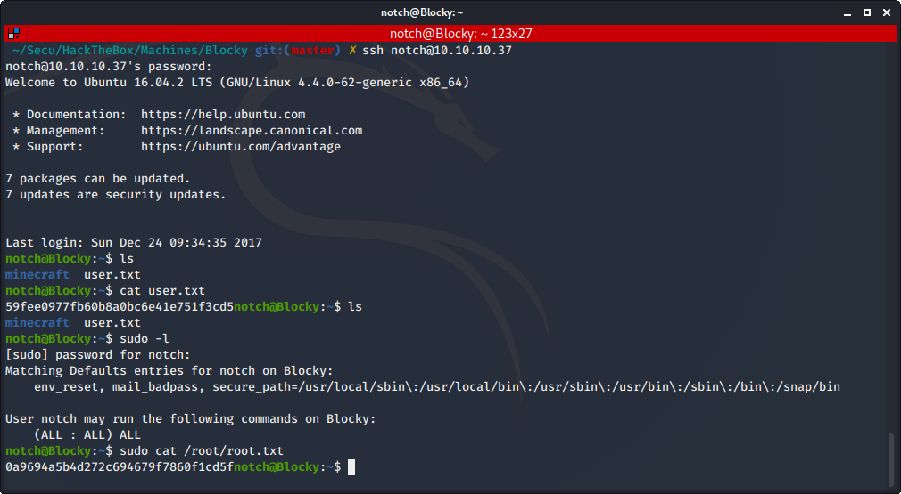

# Blocky

Auteur: Ewaël

**Blocky** is an easy HackTheBox box by Arrexel.

I start by a usual nmap scan with ```nmap -sC -sV -oN nmap 10.10.10.37 -v -A```. Port 80 is open so I decide to look at [http://10.10.10.37](http://10.10.10.37).


After going around I download RSS resources provided to check if there's anything interesting inside.


Nothing useful there, let's `dirb http://10.10.10.17`. I find a `worpress` dir corresponding to the login page, and an interesting `/plugins` that I decide to check out. I find 2 files that I can download, which I do. After a quick `cat BlockyCore.class`, I find root creds `root:8YsqfCTnvxAUeduzjNSXe22`.

At the same time I see dirb has found a `phpmyadmin` dir on the site, which seems to wait for the creds I just found:


Indeed I successfully log as root on the admin panel:


The thing is... I have no idea what I can do from this panel. I've never heard about *phpMyAdmin* before so I decide to try some stuff around before exploiting this. Those creds are refused by the *wordpress* authentification page, but I find a `Notch` user when exploring the site:


He seems the be running the site, so I expect him to have the root access I just got. What if this guy uses the same password for his ssh account? I run `ssh notch@10.10.10.37` with "8YsqfCTnvxAUeduzjNSXe22" as the password and... Surprise, it works.

From there the box becomes clearly disappointing, because Notch can actually execute any `sudo` commands:



User: `59fee0977fb60b8a0bc6e41e751f3cd5`

Root: `0a9694a5b4d272c694679f7860f1cd5f`
