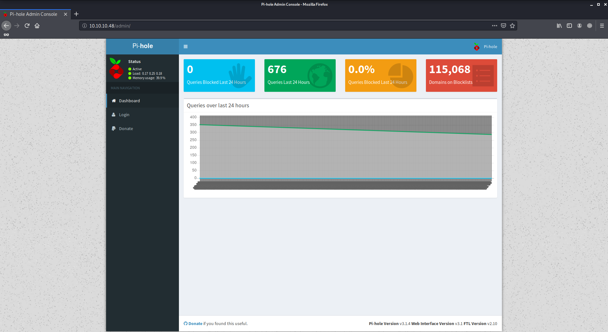
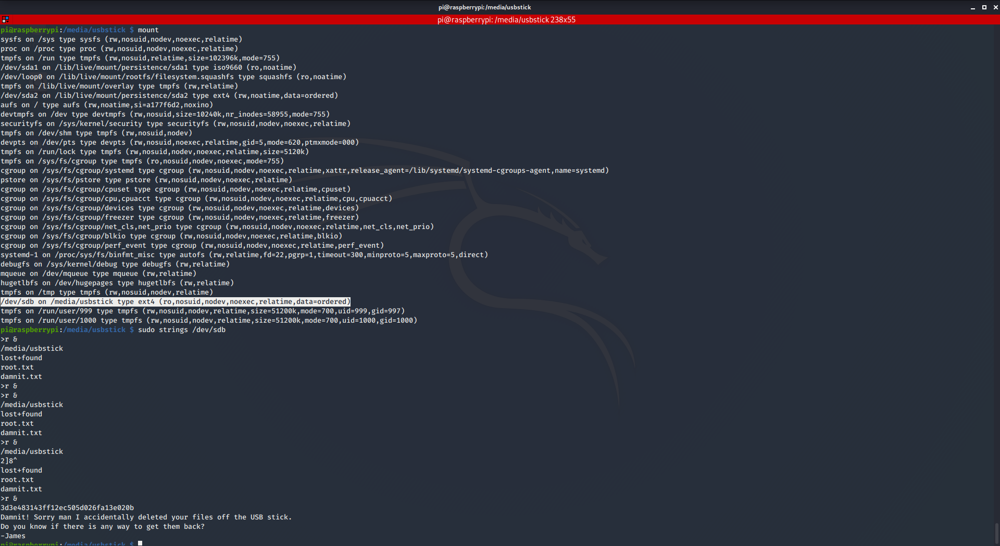

# Mirai

Author: Ewaël

**Mirai** is an easy HackTheBox box by Arrexel.

`nmap -sC -sV -oN nmap 10.10.10.48 -v -A` shows ports 22, 53 and 80 are open. I usually start with the website, but nothing is printed on [http://10.10.10.48](http://10.10.10.48). Thus I decide to use `dirb http://10.10.10.48` which returns a `/admin` page:



I try to log but the default *Pi-hole* password is randomly generated and basic passwords don't work. But now that I have the information the machine is a raspberry pi I can try to log in ssh with their default credentitials `pi:raspberry`.

I obtain the user flag in `Desktop`:

`ff837707441b257a20e32199d7c8838d`

Then `sudo -l` shows I can run everything I want as root, but `/root/root.txt` contains a surprise:

```
I lost my original root.txt! I think I may have a backup on my USB stick...
```

When going to `/media/usbstick`, I print `damnit.txt`:

```
Damnit! Sorry man I accidentally deleted your files off the USB stick.
Do you know if there is any way to get them back?

-James
```

As `photorec` and `testdisk` are not on the machine I use `mount` to find `usbstick` and `strings` on it:



And I get the root flag:

`3d3e483143ff12ec505d026fa13e020b`
