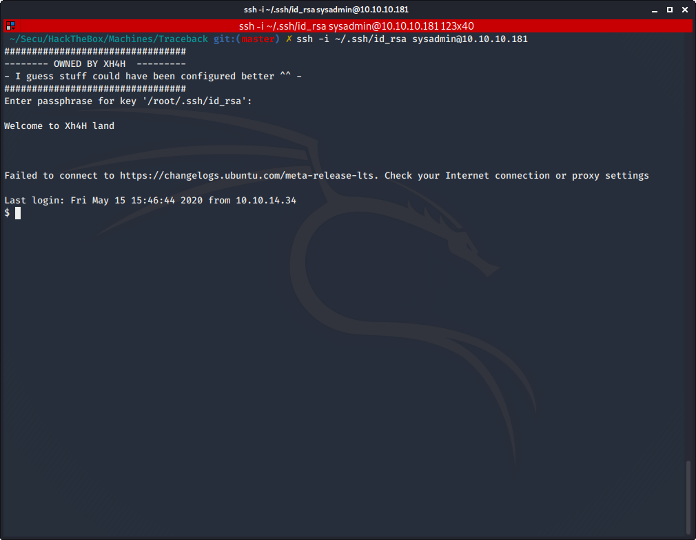

# Traceback

Author: Ewaël

**Traceback** is an easy HackTheBox box by Xh4H.

`nmap -sC -sV -oN nmap 10.10.10.181 -v -A` shows ports 22 and 80 are open. Let's check the website first as it is often a good entry point.


Seems like the site has been owned already, let's check the code source. I find a hint the hacker let behind him:

```html
<!--Some of the best web shells that you might need ;)-->
```

After a quick Google research, I find this site:

[https://github.com/TheBinitGhimire/Web-Shells](https://github.com/TheBinitGhimire/Web-Shells)

I decide to check if one of those shells is the one used for the backdoor. I find that `/smevk.php` is indeed the working one.


I enter `admin:admin` as the default creds and I access to the backdoor interface.


As the console is very uncommode to use, I decide to upload a reverse shell for my privilege escalation. I start by copying the shell:

```bash
cp /usr/share/laudanum/php/php-reverse-shell.php .
```

Then I modify the IP:port with mine and upload it on the site. Finally, I get my shell on the host after visiting the uploaded shell as `webadmin`.

### Privilege escalation

Let's start the privilege escalation. First thing to do is visiting `/home/webadmin` dir. I find a `note.txt`:

```
- sysadmin -
I have left a tool to practice Lua.
I'm sure you know where to find it.
Contact me if you have any question.
```

Indeed `sudo -l` shows me that I can execute `/home/sysadmin/luvit` as `sysadmin` without password, thus I can open a shell as `sysadmin` too with `sudo -u sysadmin /home/sysadmin/luvit -e 'os.execute("/bin/sh")'`.

I am now `sysadmin` and I can get my user flag in my home directory:

`b09d9243259a4192211fabae1647d210`

I use `/bin/sh -i` to get a proper shell, but I suddenly remember that ssh was open on the box too. Thus I decide to add my own public key in the `authorized_keys` file located in `~/.ssh` in order to log via ssh as `sysadmin` with my own private key.

```
ssh -i ~/.ssh/id_rsa sysadmin@10.10.10.181
```

After logging in I start looking around and searching for files I can interact with. I find something interesting in `/etc`:

```
drwxr-xr-x  2 root sysadmin  4096 Aug 27  2019 update-motd.d
```

Inside this dir I find `00-header` with root SUID set on it, which is the script executed when logging in the box via ssh to print a message:



I modify the script so it prints the root flag when logging in with `echo "cat /root/root.txt" >> 00-header` and I exit. When logging in again, I successfully get my root flag:

`344ce1463e61ac4da66248ee8557f901`
